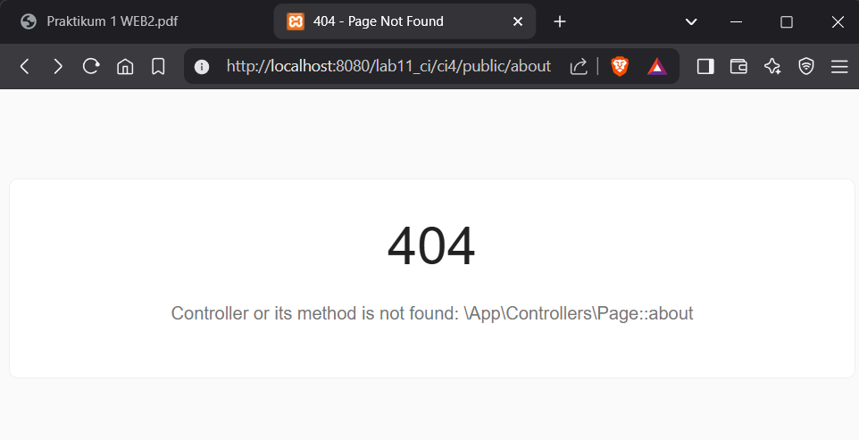
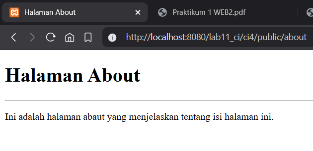

# Praktikum 1-11 Pemrograman Web 2

```bash
Aldi Hermansyah - 312310200 - Ti.23.A2
```

---

# Daftar Praktikum
**[Praktikum 1](#praktikum-1)** - **[Praktikum 2](#praktikum-2)** - **[Praktikum 3](#praktikum-3)** - **[Praktikum 4](#praktikum-4)** - **[Praktikum 5](#praktikum-5)** - **[Praktikum 6](#praktikum-6)** - **[Praktikum 7](#praktikum-7)** - **[Praktikum 8](#praktikum-8)** - **[Praktikum 9](#praktikum-9)** - **[Praktikum 10](#praktikum-10)** - **[Praktikum 11](#praktikum-11)**

---

# Praktikum 1
**[Kembali Ke Atas ⬆️](#praktikum-1-11-pemrograman-web-2)**

### 1.1. Aktifkan Extensi

Buka `xampp -> apache -> config -> php.ini`

Hilangkan tanda `;` pada ekstensi yang akan diaktifkan. Kemudian simpan kembali filenya dan restart Apache web server.


---

### 1.2. Buka Browser

Ketik http://localhost:8080/lab11_ci/ci4/public/ di browser. Akan muncul seperti gambar dibawah.


Jika error:

```bash
The framework needs the following extension(s) installed and loaded: intl.
```

Pada baris di [Langkah 1](#11-aktifkan-extensi), belum dihilangkan `;`

```bash
before: ;extension=intl
after: extension=intl
```

---

### 1.3. Buka PowerShell atau CMD

Arahkan ke direktori project `C:/xampp/htdocs/lab11_ci/ci4`. Codeigniter 4 menyediakan CLI untuk mempermudah proses development.


---

### 1.4. Jalankan Perintah

Perintah yang dapat dijalankan untuk memanggil CLI Codeigniter:

```bash
php spark
```


---

### 1.5. Ubah Nama File

File `env` menjadi `.env` dan mengubah nilai variabel `CI_ENVIRONTMENT` menjadi `development`


---

### 1.6. Contoh Error


---

### 1.7. Mencoba Error

Untuk mencoba error diatas, ubah kode pada file `app/Controllers/Home.php`, hilangkan `;` pada akhir kode.


---

### 1.8. Struktur Direktori ci4

Fokus pada folder `app`, dimana folder tersebut adalah area kerja untuk membuat aplikasi. Folder `public` untuk menyimpan aset web seperti `css, gambar, javascript, dll.`


---

### 1.9. Letak Route

Router terletak pada file `app/Config/Routes.php`. Tambahkan kode berikut:

```php
$routes->get('/about', 'Page::about');
$routes->get('/contact', 'Page::contact');
$routes->get('/faqs', 'Page::faqs');
```


---

### 1.10. Buka PowerShell

Jalankan perintah:

```bash
php spark routes
```


---

### 1.11. Akses Route

Coba akses route di browser http://localhost:8080/lab11_ci/ci4/public/about dan lihat apa yang terjadi. Ketika diakses akan muncul tampilan error `404 file not found`, artinya file/page tersebut tidak ada.



---

### 1.12. Membuat Controller

Buat file baru dengan nama `Page.php` pada direktori `Controllers` dan isi kodenya:

```php
<?php
namespace App\Controllers;
class Page extends BaseController
{
   public function about()
   {
      echo "Ini halaman About";
   }
   public function contact()
   {
      echo "Ini halaman Contact";
   }
   public function faqs()
   {
      echo "Ini halaman FAQ";
   }
}
```


---

### 1.13. Akses Kembali

Refresh kembali browser, maka halaman sudah dapat diakses.


---

### 1.14 Method Baru

Pada `app/Controllers/Page.php` tambahkan kode berikut:

```php
public function tos()
{
   echo "ini halaman Term of Services";
}
```


---

### 1.15. Akses Method Baru

Akses dengan alamat http://localhost:8080/lab11_ci/ci4/public/tos


---

### 1.16. Membuat View

Pada direktori `app/Views` buat file baru dengan nama `about.php` dan tambahkan kode berikut:

```html
<!DOCTYPE html>
<html lang="en">
<head>
   <meta charset="UTF-8">
   <title><?= $title; ?></title>
</head>
<body>
   <h1><?= $title; ?></h1>
   <hr>
   <p><?= $content; ?></p>
</body>
</html>

```


---

### 1.17. Ubah Method About

Pada `app/Controllers/Page.php` ubah:

```php
public function about()
{
   echo "Ini halaman About";
}
```

Menjadi:

```php
public function about()
{
   return view('about', [
      'title' => 'Halaman About',
      'content' => 'Ini adalah halaman abaut yang menjelaskan tentang isi halaman ini.'
   ]);
}
```


---

### 1.18. Refresh Halaman



---

### 1.19. Membuat Layout CSS

Buat file `style.css` pada direktori `public`. Pada praktikum `lab4_layout` CSS sudah pernah dibuat, copy saja filenya ke direktori `public`.


---

### 1.20. Buat Folder Template

Pada direktori `Views` buat folder `template`. Kemudia buat file `header.php`:

```html
<!DOCTYPE html>
<html lang="en">

<head>
    <meta charset="UTF-8">
    <title><?= $title; ?></title>
    <link rel="stylesheet" href="<?= base_url('/style.css'); ?>">
</head>

<body>
    <div id="container">
        <header>
            <h1>Layout Sederhana</h1>
        </header>
        <nav>
            <a href="<?= base_url('/'); ?>" class="active">Home</a>
            <a href="<?= base_url('/artikel'); ?>">Artikel</a>
            <a href="<?= base_url('/about'); ?>">About</a>
            <a href="<?= base_url('/contact'); ?>">Kontak</a>
        </nav>
        <section id="wrapper">
            <section id="main">
```

dan `footer.php`:

```html
         </section>
            <aside id="sidebar">
                <div class="widget-box">
                    <h3 class="title">Widget Header</h3>
                    <ul>
                        <li><a href="#">Widget Link</a></li>
                        <li><a href="#">Widget Link</a></li>
                    </ul>
                </div>
                <div class="widget-box">
                    <h3 class="title">Widget Text</h3>
                    <p>
                        Vestibulum lorem elit, iaculis in nisl volutpat, malesuada tincidunt arcu. Proin in leo fringilla, vestibulum mi porta,faucibus felis. Integer pharetra est nunc, nec pretium nunc pretium ac.
                    </p>
                </div>
            </aside>
        </section>
        <footer>
            <p>&copy; 2021 - Universitas Pelita Bangsa</p>
        </footer>
    </div>
</body>

</html>
```


---

### 1.21. Ubah File About

Ubah file `app/Views/about.php` dari:

```php
<h1><?= $title; ?></h1>
<hr>
<p><?= $content; ?></p>
```

menjadi:

```php
<?= $this->include('template/header'); ?>

<h1><?= $title; ?></h1>
<hr>
<p><?= $content; ?></p>

<?= $this->include('template/footer'); ?>
```


---

### 1.22. Refresh Halaman About

Refresh tampilan pada alamat http://localhost:8080/lab11_ci/ci4/public/about


---

# Praktikum 2
**[Kembali Ke Atas ⬆️](#praktikum-1-11-pemrograman-web-2)**

### 2.1. Buat Database

```sql
CREATE DATABASE lab_ci4;
```


---

### 2.2. Buat Tabel

```sql
CREATE TABLE artikel (
   id INT(11) auto_increment,
   judul VARCHAR(200) NOT NULL,
   isi TEXT,
   gambar VARCHAR(200),
   status TINYINT(1) DEFAULT 0,
   slug VARCHAR(200),
   PRIMARY KEY(id)
);
```


---

### 2.3. Konfigurasi Menghubungkan Database Server

Ada dua cara:
1. pada file `app/Config/Database.php`
2. menggunakan file `.env`


---

### 2.4. Buat File `ArtikelModel.php`

Code:
```php
<?php
namespace App\Models;

use CodeIgniter\Model;

class ArtikelModel extends Model
{
   protected $table = 'artikel';
   protected $primaryKey = 'id';
   protected $useAutoIncrement = true;
   protected $allowedFields = ['judul', 'isi', 'status', 'slug', 'gambar'];
}
```


---

### 2.5. Buat File `Artikel.php`

Code:
```php
<?php

namespace App\Controllers;

use App\Models\ArtikelModel;

class Artikel extends BaseController
{
	public function index()
	{
		$title = 'Daftar Artikel';
		$model = new ArtikelModel();
		$artikel = $model->findAll();
		return view('artikel/index', compact('artikel', 'title'));
	}
}
```


---

### 2.6. Akses `http://localhost:8080/lab11_ci/ci4/public/artikel`

Buat direktori baru `artikel` pada `App/Views` dan buat file baru `index.php`
```php
<?= $this->include('template/header'); ?>

<?php if ($artikel): foreach ($artikel as $row): ?>
        <article class="entry">
            <h2>
                <a href="<?= base_url('/artikel/' . $row['slug']); ?>">
                    <?= $row['judul']; ?>
                </a>
            </h2>
            <p><?= substr($row['isi'], 0, 200); ?></p>
        </article>
        <hr class="divider" />
    <?php endforeach;
else: ?>
    <article class="entry">
        <h2>Belum ada data.</h2>
    </article>
<?php endif; ?>

<?= $this->include('template/footer');

```


---

### 2.7. Tambahkan data pada Database

```sql
INSERT INTO artikel (judul, isi, slug) VALUE
   ('Artikel pertama', 'Lorem Ipsum adalah contoh teks atau dummy dalam industri percetakan dan penataan huruf atau typesetting. Lorem Ipsum telah menjadi standar contoh teks sejak tahun 1500an, saat seorang tukang cetak yang tidak dikenal mengambil sebuah kumpulan teks dan mengacaknya untuk menjadi sebuah buku contoh huruf.', 'artikel-pertama'),
   ('Artikel kedua', 'Tidak seperti anggapan banyak orang, Lorem Ipsum bukanlah teks-teks yang diacak. Ia berakar dari sebuah naskah sastra latin klasik dari era 45 sebelum masehi, hingga bisa dipastikan usianya telah mencapai lebih dari 2000 tahun.', 'artikel-kedua')
;
```

Refresh kembali `http://localhost:8080/lab11_ci/ci4/public/artikel`


---

### 2.8. Buat Detail Artikel

Tambahkan fungsi baru pada `Controllers/Artikel.php`:
```php
public function view($slug)
{
   $model = new ArtikelModel();
   $artikel = $model->where([
      'slug' => $slug
   ])->first();
           
   // Menampilkan error apabila data tidak ada.
   if (!$artikel) {
      throw PageNotFoundException::forPageNotFound();
   }
   $title = $artikel['judul'];
   return view('artikel/detail', compact('artikel', 'title'));
}
```

Buat view baru `app/Views/detail.php`
```php
<?= $this->include('template/header'); ?>
<article class="entry">
    <h2><?= $artikel['judul']; ?></h2>
    <!-- " alt="<?= $artikel['judul']; ?>"> -->
    <p><?= $artikel['isi']; ?></p>
</article>
<?= $this->include('template/footer'); ?>
```

Buka `app/Config/Routes.php` dan tambahkan:
```php
$routes->get('/artikel/(:any)', 'Artikel::view/$1');
```


---

### 2.9. Buat Menu Admin

Untuk proses CRUD data artikel. Buat method pada `Controllers/Artikel.php`:
```php
public function admin_index()
{
	$title = 'Daftar Artikel';
	$model = new ArtikelModel();
	$artikel = $model->findAll();
	return view('artikel/admin_index', compact('artikel', 'title'));
}
```

Buat view untuk tampilan admin `admin_index.php`:
```php
<?= $this->include('template/admin_header'); ?>
<div class="content-artikel">
    <table class="table">
        <thead>
            <tr>
                <th>ID</th>
                <th>Judul</th>
                <th>Status</th>
                <th>Aksi</th>
            </tr>
        </thead>
        <tbody>
            <?php if ($artikel): foreach ($artikel as $row): ?>
                    <tr>
                        <td><?= $row['id']; ?></td>
                        <td>
                            <b><?= $row['judul']; ?></b>
                            <p><small><?= substr($row['isi'], 0, 50); ?></small></p>
                        </td>
                        <td><?= $row['status']; ?></td>
                        <td>
                            <a class="btn btn-edit" href="<?= base_url('/admin/artikel/edit/' . $row['id']); ?>">Ubah</a>
                            <a class="btn btn-danger" onclick="return confirm('Yakin menghapus data?');"
                                href="<?= base_url('/admin/artikel/delete/' . $row['id']); ?>">Hapus</a>
                        </td>
                    </tr>
                <?php endforeach;
            else: ?>
                <tr>
                    <td colspan="4">Belum ada data.</td>
                </tr>
            <?php endif; ?>
        </tbody>
    </table>
</div>
<?= $this->include('template/admin_footer'); ?>
```

Tambahkan pada `app/Config/Routes.php`:
```php
$routes->group('admin', function ($routes) {
    $routes->get('artikel', 'Artikel::admin_index');
    $routes->add('artikel/add', 'Artikel::add');
    $routes->add('artikel/edit/(:any)', 'Artikel::edit/$1');
    $routes->get('artikel/delete/(:any)', 'Artikel::delete/$1');
});
```

Akses `http://localhost:8080/lab11_ci/ci4/public/admin/artikel`


---

### 2.10. Menambahkan Data Artikel

Tambahkan fungsi baru `add()` pada `Controllers/Artikel.php`:
```php
public function add()
{
    // validasi data.
    $validation = \Config\Services::validation();
    $validation->setRules(['judul' => 'required']);
    $isDataValid = $validation->withRequest($this->request)->run();
    if ($isDataValid) {
        $artikel = new ArtikelModel();
        $artikel->insert([
            'judul' => $this->request->getPost('judul'),
            'isi' => $this->request->getPost('isi'),
            'slug' => url_title($this->request->getPost('judul')),
        ]);
        return redirect('admin/artikel');
    }
    $title = "Tambah Artikel";
    return view('artikel/form_add', compact('title'));
}
```

Buat view `form_add.php`:
```php
<?= $this->include('template/admin_header'); ?>
<h2><?= $title; ?></h2>
<form action="" method="post">
    <p>
        <input type="text" name="judul">
    </p>
    <p>
        <textarea name="isi" cols="50" rows="10"></textarea>
    </p>
    <p><input type="submit" value="Kirim" class="btn btn-large"></p>
</form>
<?= $this->include('template/admin_footer'); ?>
```


---

### 2.11. Mengubah Data

Tambahkan fungsi baru `edit()` pada `Controllers/Artikel.php`:
```php
public function edit($id)
{
    $artikel = new ArtikelModel();
    // validasi data.
    $validation = \Config\Services::validation();
    $validation->setRules(['judul' => 'required']);
    $isDataValid = $validation->withRequest($this->request)->run();
    if ($isDataValid) {
        $artikel->update($id, [
            'judul' => $this->request->getPost('judul'),
            'isi' => $this->request->getPost('isi'),
        ]);
        return redirect('admin/artikel');
    }
    // ambil data lama
    $data = $artikel->where('id', $id)->first();
    $title = "Edit Artikel";
    return view('artikel/form_edit', compact('title', 'data'));
}
```

Buat view `form_edit.php`:
```php
<?= $this->include('template/admin_header'); ?>
<h2><?= $title; ?></h2>
<form action="" method="post">
    <p>
        <input type="text" name="judul" value="<?= $data['judul']; ?>">
    </p>
    <p>
        <textarea name="isi" cols="50" rows="10"><?= $data['isi']; ?></textarea>
    </p>
    <p><input type="submit" value="Kirim" class="btn btn-large"></p>
</form>
<?= $this->include('template/admin_footer'); ?>
```


Tambahkan fungsi baru `delete()` pada `Controllers/Artikel.php`:
```php
public function delete($id)
{
    $artikel = new ArtikelModel();
    $artikel->delete($id);
    return redirect('admin/artikel');
}
```

---

# Praktikum 3
**[Kembali Ke Atas ⬆️](#praktikum-1-11-pemrograman-web-2)**

### 3.1. Buat Layout Utama

Buat folder `layout` di dalam `app/Views/` dan buat file `main.php` di dalamnya:
```html
<!DOCTYPE html>
<html lang="en">

<head>
    <meta charset="UTF-8">
    <title><?= $title ?? 'My Website' ?></title>
    <link rel="stylesheet" href="<?= base_url('/style.css'); ?>">
</head>

<body>
    <div id="container">
        <header>
            <h1>Layout Sederhana</h1>
        </header>
        <nav>
            <a href="<?= base_url('/'); ?>" class="active">Home</a>
            <a href="<?= base_url('/artikel'); ?>">Artikel</a>
            <a href="<?= base_url('/about'); ?>">About</a>
            <a href="<?= base_url('/contact'); ?>">Kontak</a>
        </nav>
        <section id="wrapper">
            <section id="main">
                <?= $this->renderSection('content') ?>
            </section>
            <aside id="sidebar">
                <?= view_cell('App\\Cells\\ArtikelTerkini::render') ?>
                <div class="widget-box">
                    <h3 class="title">Widget Header</h3>
                    <ul>
                        <li><a href="#">Widget Link</a></li>
                        <li><a href="#">Widget Link</a></li>
                    </ul>
                </div>
                <div class="widget-box">
                    <h3 class="title">Widget Text</h3>
                    <p>
                        Vestibulum lorem elit, iaculis in nisl volutpat, malesuada tincidunt arcu. Proin in leo fringilla, vestibulum mi porta, faucibus felis. Integer pharetra est nunc, nec pretium nunc pretium ac.
                    </p>
                </div>
            </aside>
        </section>
        <footer>
            <p>&copy; 2025 - Universitas Pelita Bangsa</p>
        </footer>
    </div>
</body>

</html>
```

### 3.2. Modifikasi File View

Ubah `app/Views/home.php`:
```php
<?= $this->extend('layout/main') ?>

<?= $this->section('content') ?>

<h1><?= $title; ?></h1>
<hr>
<p><?= $content; ?></p>

<?= $this->endSection() ?>
```

### 3.2. Menampilkan Data Dinamis dengan View Cell

Buat folder `Cells` di dalam `app` dan buat file `ArtikelTerkini.php` di dalam `app/Cells`:
```php
<?php

namespace App\Cells;

use CodeIgniter\View\Cell;
use App\Models\ArtikelModel;

class ArtikelTerkini extends Cell
{
    public function render()
    {
        $model = new ArtikelModel();
        $artikel = $model->orderBy('created_at', 'DESC')->limit(5)->findAll();
        return view('components/artikel_terkini', ['artikel' => $artikel]);
    }
}
```

### 3.2. Membuat View untuk View Cell

Buat folder `components` di dalam `app/Views` dan buat file `artikel_terkini.php` di dalam `app/Views/components`:
```php
<h3>Artikel Terkini</h3>
<ul>
    <?php foreach ($artikel as $row): ?>
        <li>
            <a href="<?= base_url('/artikel/' . $row['slug']) ?>"><?= $row['judul'] ?></a>
        </li>
    <?php endforeach; ?>
</ul>
```

---

Pertanyan dan Tugas Praktikum 3
* Sesuaikan data dengan praktikum sebelumnya, perlu melakukan perubahan field pada database dengan menambahkan tanggal agar dapat mengambil data artikel terbaru.

**Jawab:**


* Selesaikan programnya sesuai langkah-langkah yang ada. Anda boleh melakukan improvisasi.

**Jawab:**


* Apa manfaat utama dari penggunaan View Layout dalam pengembangan aplikasi?

**Jawab:**

> Memisahkan bagian-bagian seperti header, footer, dan sidebar dari konten utama. <br>
> Tidak perlu menulis ulang struktur HTML yang sama di setiap halaman. <br>
> Semua halaman memiliki layout yang seragam. <br>
> Perubahan di satu file layout akan otomatis berdampak ke semua halaman yang menggunakannya.

* Jelaskan perbedaan antara View Cell dan View biasa.

**Jawab:**

> | Aspek            | View Cell                                                                 | View Biasa                                          |
> |------------------|---------------------------------------------------------------------------|-----------------------------------------------------|
> | **Fungsi**        | Memanggil _view_ dari method di dalam class, biasanya untuk widget kecil | Menampilkan file view secara langsung               |
> | **Lokasi Logika** | Logika dan data disiapkan dalam class callable                            | Logika disiapkan di controller lalu dikirim ke view |
> | **Kapan digunakan** | Untuk komponen kecil yang reusable dan berdiri sendiri                   | Untuk halaman utama atau tampilan penuh             |
> | **Contoh**        | `<?= view_cell('App\\Cells\\ArtikelTerkini::render') ?>`                       | `return view('home');`                              |

* Ubah View Cell agar hanya menampilkan post dengan kategori tertentu.

**Jawab:**

Dengan sedikit improvisasi, menambahkan `Artikel Kesehatan` dan mengkategorikannya dengan `Artikel Kedua` menjadi `Kesehatan`. Maka yang muncul di `Artikel Terkini` adalah artikel yang memiliki kategori `Kesehatan`.


---

# Praktikum 4
**[Kembali Ke Atas ⬆️](#praktikum-1-11-pemrograman-web-2)**

### 4.1. Buat Tabel User Login

Code:
```sql
CREATE TABLE user (
	id INT(11) auto_increment,
	username VARCHAR(200) NOT NULL,
	useremail VARCHAR(200),
	userpassword VARCHAR(200),
	PRIMARY KEY(id)
);
```


### 4.2. Buat Model User

Buat Model pada direktori `app/Models` dengan nama `UserModel.php` untuk memproses login:
```php
<?php

namespace App\Models;

use CodeIgniter\Model;

class UserModel extends Model
{
    protected $table = 'user';
    protected $primaryKey = 'id';
    protected $useAutoIncrement = true;
    protected $allowedFields = ['username', 'useremail', 'userpassword'];
}
```

### 4.3. Buat Controller User

Pada direktori `app/Controllers` buat file `User.php` dan tambahkan fungsi `index()` untuk menampilkan daftar user, dan fungsi `login()` untuk proses login:

```php
<?php

namespace App\Controllers;

use App\Models\UserModel;

class User extends BaseController
{
    public function index()
    {
        $title = 'Daftar User';
        $model = new UserModel();
        $users = $model->findAll();
        return view('user/index', compact('users', 'title'));
    }
    public function login()
    {
        helper(['form']);
        $email = $this->request->getPost('email');
        $password = $this->request->getPost('password');
        if (!$email) {
            return view('user/login');
        }
        $session = session();
        $model = new UserModel();
        $login = $model->where('useremail', $email)->first();
        if ($login) {
            $pass = $login['userpassword'];
            if (password_verify($password, $pass)) {
                $login_data = [
                    'user_id' => $login['id'],
                    'user_name' => $login['username'],
                    'user_email' => $login['useremail'],
                    'logged_in' => TRUE,
                ];
                $session->set($login_data);
                return redirect('admin/artikel');
            } else {
                $session->setFlashdata("flash_msg", "Password salah.");
                return redirect()->to('/user/login');
            }
        } else {
            $session->setFlashdata("flash_msg", "email tidak terdaftar.");
            return redirect()->to('/user/login');
        }
    }
}
```

### 4.4. Buat View Login

Buat direktori baru `user` di `app/Views`, lalu buat file `login.php`:
```html
<!DOCTYPE html>
<html lang="en">

<head>
    <meta charset="UTF-8">
    <title>Login</title>
    <link rel="stylesheet" href="<?= base_url('/style.css'); ?>">
</head>

<body>
    <div id="login-wrapper">
        <h1>Sign In</h1>
        <?php if (session()->getFlashdata('flash_msg')): ?>
        <div class="alert alert-danger"><?= session()->getFlashdata('flash_msg') ?></div>
        <?php endif; ?>
        <form action="" method="post">
            <div class="mb-3">
                <label for="InputForEmail" class="form-label">Email
                    address</label>
                <input type="email" name="email" class="form-control" id="InputForEmail"
                    value="<?= set_value('email') ?>">
            </div>
            <div class="mb-3">
                <label for="InputForPassword" class="formlabel">Password</label>
                <input type="password" name="password" class="formcontrol" id="InputForPassword">
            </div>
            <button type="submit" class="btn btn-primary">Login</button>
        </form>
    </div>
</body>

</html>
```

### 4.5. Buat Database Seeder

Digunakan untuk membuat data dummy bertujuan ujicoba modul login. Buka CLI dan tulis:
```bash
php spark make:seeder UserSeeder
```


Buka file `UserSeeder.php` di dalam direktori `app/Database/Seeds/UserSeeder.php`:
```php
<?php

namespace App\Database\Seeds;

use CodeIgniter\Database\Seeder;

class UserSeeder extends Seeder
{
    public function run()
    {
        $model = model('UserModel');
        $model->insert([
            'username' => 'admin',
            'useremail' => 'admin@email.com',
            'userpassword' => password_hash('admin123', PASSWORD_DEFAULT),
        ]);
    }
}
```

Selanjutnya buka kembali CLI dan ketik:
```bash
php spark db:seed UserSeeder
```


### 4.6. Uji Coba Login

Akses http://localhost:8080/lab11_ci/ci4/public/index.php/user/login


### 4.7. Tambahkan Auth Filter

Buat file `Auth.php` pada direktori `app/Filters`:
```php
<?php

namespace App\Filters;

use CodeIgniter\HTTP\RequestInterface;
use CodeIgniter\HTTP\ResponseInterface;
use CodeIgniter\Filters\FilterInterface;

class Auth implements FilterInterface
{
    public function before(RequestInterface $request, $arguments = null)
    {
        // jika user belum login
        if (! session()->get('logged_in')) {
            // maka redirct ke halaman login
            return redirect()->to('/user/login');
        }
    }
    public function after(RequestInterface $request, ResponseInterface $response, $arguments = null)
    {
        // Do something here
    }
}
```

Buka file `app/Config/Filters.php` tambahkan:
```php
'auth'          => Auth::class,
```


Selanjutnya buka file `app/Config/Routes.php` dan sesuaikan kodenya:
```php
$routes->group('admin', ['filter' => 'auth'], function ($routes) {
    $routes->get('artikel', 'Artikel::admin_index');
    $routes->add('artikel/add', 'Artikel::add');
    $routes->add('artikel/edit/(:any)', 'Artikel::edit/$1');
    $routes->get('artikel/delete/(:any)', 'Artikel::delete/$1');
});
```


### 4.8. Percobaan Akses Menu Admin

Akses http://localhost:8080/lab11_ci/ci4/public/index.php/user/login


Jika berhasil masuk ⬇️


### 4.9. Fungsi Logout

Tambah fungsi logout pada Controller User:
```php
public function logout()
{
    session()->destroy();
    return redirect()->to('/user/login');
}
```

---

# Praktikum 5
**[Kembali Ke Atas ⬆️](#praktikum-1-11-pemrograman-web-2)**

---

# Praktikum 6
**[Kembali Ke Atas ⬆️](#praktikum-1-11-pemrograman-web-2)**

---

# Praktikum 7
**[Kembali Ke Atas ⬆️](#praktikum-1-11-pemrograman-web-2)**

---

# Praktikum 8
**[Kembali Ke Atas ⬆️](#praktikum-1-11-pemrograman-web-2)**

---

# Praktikum 9
**[Kembali Ke Atas ⬆️](#praktikum-1-11-pemrograman-web-2)**

---

# Praktikum 10
**[Kembali Ke Atas ⬆️](#praktikum-1-11-pemrograman-web-2)**

---

# Praktikum 11
**[Kembali Ke Atas ⬆️](#praktikum-1-11-pemrograman-web-2)**

---
