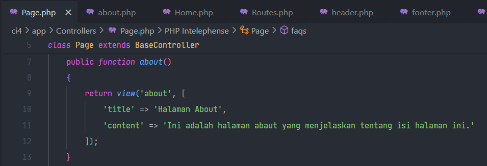

# Praktikum 1-3 Pemrograman Web 2

```bash
Aldi Hermansyah - 312310200 - Ti.23.A2
```

---

## Daftar Praktikum

*   **Praktikum 1** 
    *   1.1. [Aktifkan Extensi](#11-aktifkan-extensi)
    *   1.2. [Buka Browser](#12-buka-browser)
    *   1.3. [Buka PowerShell/CMD](#13-buka-powershell-atau-cmd)
    *   1.4. [Jalankan Perintah](#14-jalankan-perintah)
    *   1.5. [Ubah Nama File](#15-ubah-nama-file)
    *   1.6. [Contoh Error](#16-contoh-error)
    *   1.7. [Menccoba Error](#17-mencoba-error)
    *   1.8. [Instalasi Prasyarat](#18-instalasi-prasyarat)
    *   1.9. [Langkah-Langkah Instalasi](#19-langkah-langkah-instalasi)
    *   1.10. [Konfigurasi Awal](#110-konfigurasi-awal)
    *   1.11. [Penggunaan Dasar](#111-penggunaan-dasar)
    *   1.12. [Contoh Penggunaan Sederhana](#112-contoh-penggunaan-sederhana)
    *   1.13. [Struktur Kode Proyek](#113-struktur-kode-proyek)
    *   1.14. [Kontribusi](#114-kontribusi)
    *   1.15. [Lisensi](#115-lisensi)
    *   1.16. [Ucapan Terima Kasih](#116-ucapan-terima-kasih)
    *   1.17. [Kontak](#117-kontak)
    *   1.18. [FAQ (Pertanyaan yang Sering Diajukan)](#118-faq-pertanyaan-yang-sering-diajukan)
    *   1.19. [Versi Proyek](#119-versi-proyek)
    *   1.20. [Roadmap Pengembangan](#120-roadmap-pengembangan)
    *   1.21. [Dokumentasi Tambahan](#121-dokumentasi-tambahan)
    *   1.22. [Dukungan Komunitas](#122-dukungan-komunitas)
    *   1.23. [Informasi Hak Cipta](#123-informasi-hak-cipta)
    *   1.24. [Disclaimer](#124-disclaimer)
    *   1.25. [Catatan Lainnya](#125-catatan-lainnya)

---

## Praktikum 1

### 1.1. Aktifkan Extensi

Buka xampp -> apache -> config -> php.ini

Hilangkan tanda `;` pada ekstensi yang akan diaktifkan. Kemudian simpan kembali filenya dan restart Apache web server.


### 1.2. Buka Browser

Ketik http://localhost:8080/lab11_ci/ci4/public/ di browser. Akan muncul seperti gambar dibawah.


Jika error:

```bash
The framework needs the following extension(s) installed and loaded: intl.
```

Pada baris di langkah 1, belum dihilangkan `;`

```bash
before: ;extension=intl
after: extension=intl
```

### 1.3. Buka PowerShell atau CMD

Arahkan ke direktori project `C:/xampp/htdocs/lab11_ci/ci4`. Codeigniter 4 menyediakan CLI untuk mempermudah proses development.


### 1.4. Jalankan Perintah

Perintah yang dapat dijalankan untuk memanggil CLI Codeigniter:

```bash
php spark
```


### 1.5. Ubah Nama File

File `env` menjadi `.env` dan mengubah nilai variabel `CI_ENVIRONTMENT` menjadi `development`


### 1.6. Contoh Error


### 1.7. Mencoba Error

Untuk mencoba error diatas, ubah kode pada file `app/Controllers/Home.php`, hilangkan `;` pada akhir kode.


### 1.8. Struktur Direktori ci4

Fokus pada folder `app`, dimana folder tersebut adalah area kerja untuk membuat aplikasi. Folder `public` untuk menyimpan aset web seperti `css, gambar, javascript, dll.`


### 1.9. Letak Route

Router terletak pada file `app/Config/Routes.php`. Tambahkan kode berikut:

```php
$routes->get('/about', 'Page::about');
$routes->get('/contact', 'Page::contact');
$routes->get('/faqs', 'Page::faqs');
```


### 1.10. Buka PowerShell

Jalankan perintah:

```bash
php spark routes
```


### 1.11. Akses Route

Coba akses route di browser http://localhost:8080/lab11_ci/ci4/public/about dan lihat apa yang terjadi. Ketika diakses akan muncul tampilan error `404 file not found`, artinya file/page tersebut tidak ada.


### 1.12. Membuat Controller

Buat file baru dengan nama `Page.php` pada direktori `Controllers` dan isi kodenya:


### 1.13. Akses Kembali

Refresh kembali browser, maka halaman sudah dapat diakses.


### 1.14 Method Baru

Pada `app/Controllers/Page.php` tambahkan kode berikut:


### 1.15. Akses Method Baru

Akses dengan alamat http://localhost:8080/lab11_ci/ci4/public/tos


### 1.16.


### 1.17.



### 1.18.


### 1.19.


### 1.20.


### 1.21.


### 1.22.


---
