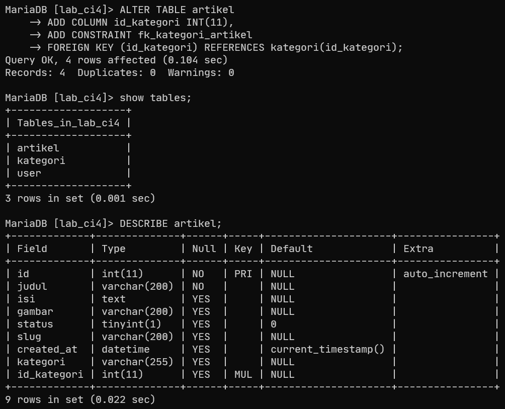

# Praktikum 1-11 Pemrograman Web 2

```bash
Aldi Hermansyah - 312310200 - Ti.23.A.2
```

---

# Daftar Praktikum
**[Praktikum 1](#praktikum-1)** - **[Praktikum 2](#praktikum-2)**

**[Praktikum 3](#praktikum-3)** - **[Praktikum 3: Pertanyaan dan Tugas](#pertanyaan-dan-tugas-praktikum-3)** 

**[Praktikum 4](#praktikum-4)** - **[Praktikum 5](#praktikum-5)** - **[Praktikum 6](#praktikum-6)**

**[Praktikum 7](#praktikum-7)** - **[Praktikum 7: Testing](#testing-praktikum-7)** - **[Praktikum 7: Pertanyaan dan Tugas](#pertanyaan-dan-tugas-praktikum-7)**

**[Praktikum 8](#praktikum-8)** - **[Praktikum 8: Pertanyaan dan Tugas](#pertanyaan-dan-tugas-praktikum-8)**

**[Praktikum 9](#praktikum-9)** - **[Praktikum 9: Pertanyaan dan Tugas](#pertanyaan-dan-tugas-praktikum-9)**

**[Praktikum 10](#praktikum-10)** - **[Praktikum 11](#praktikum-11)**

**[Link Demo](#link-demo-project)**

---

# Praktikum 1
**[Kembali Ke Atas ⬆️](#praktikum-1-11-pemrograman-web-2)**

### 1.1. Aktifkan Extensi

Buka `xampp -> apache -> config -> php.ini`

Hilangkan tanda `;` pada ekstensi yang akan diaktifkan. Kemudian simpan kembali filenya dan restart Apache web server.


---

### 1.2. Buka Browser

Ketik http://localhost:8080/lab11_ci/ci4/public/ di browser. Akan muncul seperti gambar dibawah.


Jika error:

```bash
The framework needs the following extension(s) installed and loaded: intl.
```

Pada baris di [Langkah 1](#11-aktifkan-extensi), belum dihilangkan `;`

```bash
before: ;extension=intl
after: extension=intl
```

---

### 1.3. Buka PowerShell atau CMD

Arahkan ke direktori project `C:/xampp/htdocs/lab11_ci/ci4`. Codeigniter 4 menyediakan CLI untuk mempermudah proses development.


---

### 1.4. Jalankan Perintah

Perintah yang dapat dijalankan untuk memanggil CLI Codeigniter:

```bash
php spark
```


---

### 1.5. Ubah Nama File

File `env` menjadi `.env` dan mengubah nilai variabel `CI_ENVIRONTMENT` menjadi `development`


---

### 1.6. Contoh Error


---

### 1.7. Mencoba Error

Untuk mencoba error diatas, ubah kode pada file `app/Controllers/Home.php`, hilangkan `;` pada akhir kode.


---

### 1.8. Struktur Direktori ci4

Fokus pada folder `app`, dimana folder tersebut adalah area kerja untuk membuat aplikasi. Folder `public` untuk menyimpan aset web seperti `css, gambar, javascript, dll.`


---

### 1.9. Letak Route

Router terletak pada file `app/Config/Routes.php`. Tambahkan kode berikut:

```php
$routes->get('/about', 'Page::about');
$routes->get('/contact', 'Page::contact');
$routes->get('/faqs', 'Page::faqs');
```


---

### 1.10. Buka PowerShell

Jalankan perintah:

```bash
php spark routes
```


---

### 1.11. Akses Route

Coba akses route di browser http://localhost:8080/lab11_ci/ci4/public/about dan lihat apa yang terjadi. Ketika diakses akan muncul tampilan error `404 file not found`, artinya file/page tersebut tidak ada.


---

### 1.12. Membuat Controller

Buat file baru dengan nama `Page.php` pada direktori `Controllers` dan isi kodenya:

```php
<?php
namespace App\Controllers;
class Page extends BaseController
{
   public function about()
   {
      echo "Ini halaman About";
   }
   public function contact()
   {
      echo "Ini halaman Contact";
   }
   public function faqs()
   {
      echo "Ini halaman FAQ";
   }
}
```


---

### 1.13. Akses Kembali

Refresh kembali browser, maka halaman sudah dapat diakses.


---

### 1.14 Method Baru

Pada `app/Controllers/Page.php` tambahkan kode berikut:

```php
public function tos()
{
   echo "ini halaman Term of Services";
}
```


---

### 1.15. Akses Method Baru

Akses dengan alamat http://localhost:8080/lab11_ci/ci4/public/tos


---

### 1.16. Membuat View

Pada direktori `app/Views` buat file baru dengan nama `about.php` dan tambahkan kode berikut:

```html
<!DOCTYPE html>
<html lang="en">
<head>
   <meta charset="UTF-8">
   <title><?= $title; ?></title>
</head>
<body>
   <h1><?= $title; ?></h1>
   <hr>
   <p><?= $content; ?></p>
</body>
</html>

```


---

### 1.17. Ubah Method About

Pada `app/Controllers/Page.php` ubah:

```php
public function about()
{
   echo "Ini halaman About";
}
```

Menjadi:

```php
public function about()
{
   return view('about', [
      'title' => 'Halaman About',
      'content' => 'Ini adalah halaman abaut yang menjelaskan tentang isi halaman ini.'
   ]);
}
```


---

### 1.18. Refresh Halaman


---

### 1.19. Membuat Layout CSS

Buat file `style.css` pada direktori `public`. Pada praktikum `lab4_layout` CSS sudah pernah dibuat, copy saja filenya ke direktori `public`.


---

### 1.20. Buat Folder Template

Pada direktori `Views` buat folder `template`. Kemudia buat file `header.php`:

```html
<!DOCTYPE html>
<html lang="en">

<head>
    <meta charset="UTF-8">
    <title><?= $title; ?></title>
    <link rel="stylesheet" href="<?= base_url('/style.css'); ?>">
</head>

<body>
    <div id="container">
        <header>
            <h1>Layout Sederhana</h1>
        </header>
        <nav>
            <a href="<?= base_url('/'); ?>" class="active">Home</a>
            <a href="<?= base_url('/artikel'); ?>">Artikel</a>
            <a href="<?= base_url('/about'); ?>">About</a>
            <a href="<?= base_url('/contact'); ?>">Kontak</a>
        </nav>
        <section id="wrapper">
            <section id="main">
```

dan `footer.php`:

```html
         </section>
            <aside id="sidebar">
                <div class="widget-box">
                    <h3 class="title">Widget Header</h3>
                    <ul>
                        <li><a href="#">Widget Link</a></li>
                        <li><a href="#">Widget Link</a></li>
                    </ul>
                </div>
                <div class="widget-box">
                    <h3 class="title">Widget Text</h3>
                    <p>
                        Vestibulum lorem elit, iaculis in nisl volutpat, malesuada tincidunt arcu. Proin in leo fringilla, vestibulum mi porta,faucibus felis. Integer pharetra est nunc, nec pretium nunc pretium ac.
                    </p>
                </div>
            </aside>
        </section>
        <footer>
            <p>&copy; 2021 - Universitas Pelita Bangsa</p>
        </footer>
    </div>
</body>

</html>
```


---

### 1.21. Ubah File About

Ubah file `app/Views/about.php` dari:

```php
<h1><?= $title; ?></h1>
<hr>
<p><?= $content; ?></p>
```

menjadi:

```php
<?= $this->include('template/header'); ?>

<h1><?= $title; ?></h1>
<hr>
<p><?= $content; ?></p>

<?= $this->include('template/footer'); ?>
```


---

### 1.22. Refresh Halaman About

Refresh tampilan pada alamat http://localhost:8080/lab11_ci/ci4/public/about


---

# Praktikum 2
**[Kembali Ke Atas ⬆️](#praktikum-1-11-pemrograman-web-2)**

### 2.1. Buat Database

```sql
CREATE DATABASE lab_ci4;
```


---

### 2.2. Buat Tabel

```sql
CREATE TABLE artikel (
   id INT(11) auto_increment,
   judul VARCHAR(200) NOT NULL,
   isi TEXT,
   gambar VARCHAR(200),
   status TINYINT(1) DEFAULT 0,
   slug VARCHAR(200),
   PRIMARY KEY(id)
);
```


---

### 2.3. Konfigurasi Menghubungkan Database Server

Ada dua cara:
1. pada file `app/Config/Database.php`
2. menggunakan file `.env`


---

### 2.4. Buat File `ArtikelModel.php`

Code:
```php
<?php
namespace App\Models;

use CodeIgniter\Model;

class ArtikelModel extends Model
{
   protected $table = 'artikel';
   protected $primaryKey = 'id';
   protected $useAutoIncrement = true;
   protected $allowedFields = ['judul', 'isi', 'status', 'slug', 'gambar'];
}
```


---

### 2.5. Buat File `Artikel.php`

Code:
```php
<?php

namespace App\Controllers;

use App\Models\ArtikelModel;

class Artikel extends BaseController
{
	public function index()
	{
		$title = 'Daftar Artikel';
		$model = new ArtikelModel();
		$artikel = $model->findAll();
		return view('artikel/index', compact('artikel', 'title'));
	}
}
```


---

### 2.6. Akses `http://localhost:8080/lab11_ci/ci4/public/artikel`

Buat direktori baru `artikel` pada `App/Views` dan buat file baru `index.php`
```php
<?= $this->include('template/header'); ?>

<?php if ($artikel): foreach ($artikel as $row): ?>
        <article class="entry">
            <h2>
                <a href="<?= base_url('/artikel/' . $row['slug']); ?>">
                    <?= $row['judul']; ?>
                </a>
            </h2>
            <p><?= substr($row['isi'], 0, 200); ?></p>
        </article>
        <hr class="divider" />
    <?php endforeach;
else: ?>
    <article class="entry">
        <h2>Belum ada data.</h2>
    </article>
<?php endif; ?>

<?= $this->include('template/footer');

```


---

### 2.7. Tambahkan data pada Database

```sql
INSERT INTO artikel (judul, isi, slug) VALUE
   ('Artikel pertama', 'Lorem Ipsum adalah contoh teks atau dummy dalam industri percetakan dan penataan huruf atau typesetting. Lorem Ipsum telah menjadi standar contoh teks sejak tahun 1500an, saat seorang tukang cetak yang tidak dikenal mengambil sebuah kumpulan teks dan mengacaknya untuk menjadi sebuah buku contoh huruf.', 'artikel-pertama'),
   ('Artikel kedua', 'Tidak seperti anggapan banyak orang, Lorem Ipsum bukanlah teks-teks yang diacak. Ia berakar dari sebuah naskah sastra latin klasik dari era 45 sebelum masehi, hingga bisa dipastikan usianya telah mencapai lebih dari 2000 tahun.', 'artikel-kedua')
;
```

Refresh kembali `http://localhost:8080/lab11_ci/ci4/public/artikel`


---

### 2.8. Buat Detail Artikel

Tambahkan fungsi baru pada `Controllers/Artikel.php`:
```php
public function view($slug)
{
   $model = new ArtikelModel();
   $artikel = $model->where([
      'slug' => $slug
   ])->first();
           
   // Menampilkan error apabila data tidak ada.
   if (!$artikel) {
      throw PageNotFoundException::forPageNotFound();
   }
   $title = $artikel['judul'];
   return view('artikel/detail', compact('artikel', 'title'));
}
```

Buat view baru `app/Views/detail.php`
```php
<?= $this->include('template/header'); ?>
<article class="entry">
    <h2><?= $artikel['judul']; ?></h2>
    <!-- " alt="<?= $artikel['judul']; ?>"> -->
    <p><?= $artikel['isi']; ?></p>
</article>
<?= $this->include('template/footer'); ?>
```

Buka `app/Config/Routes.php` dan tambahkan:
```php
$routes->get('/artikel/(:any)', 'Artikel::view/$1');
```


---

### 2.9. Buat Menu Admin

Untuk proses CRUD data artikel. Buat method pada `Controllers/Artikel.php`:
```php
public function admin_index()
{
    $title = 'Daftar Artikel';
    $model = new ArtikelModel();
    $artikel = $model->findAll();
    return view('artikel/admin_index', compact('artikel', 'title'));
}
```

Buat view untuk tampilan admin `admin_index.php`:
```php
<?= $this->include('template/admin_header'); ?>
<div class="content-artikel">
    <table class="table">
        <thead>
            <tr>
                <th>ID</th>
                <th>Judul</th>
                <th>Status</th>
                <th>Aksi</th>
            </tr>
        </thead>
        <tbody>
            <?php if ($artikel): foreach ($artikel as $row): ?>
                    <tr>
                        <td><?= $row['id']; ?></td>
                        <td>
                            <b><?= $row['judul']; ?></b>
                            <p><small><?= substr($row['isi'], 0, 50); ?></small></p>
                        </td>
                        <td><?= $row['status']; ?></td>
                        <td>
                            <a class="btn btn-edit" href="<?= base_url('/admin/artikel/edit/' . $row['id']); ?>">Ubah</a>
                            <a class="btn btn-danger" onclick="return confirm('Yakin menghapus data?');"
                                href="<?= base_url('/admin/artikel/delete/' . $row['id']); ?>">Hapus</a>
                        </td>
                    </tr>
                <?php endforeach;
            else: ?>
                <tr>
                    <td colspan="4">Belum ada data.</td>
                </tr>
            <?php endif; ?>
        </tbody>
    </table>
</div>
<?= $this->include('template/admin_footer'); ?>
```

Tambahkan pada `app/Config/Routes.php`:
```php
$routes->group('admin', function ($routes) {
    $routes->get('artikel', 'Artikel::admin_index');
    $routes->add('artikel/add', 'Artikel::add');
    $routes->add('artikel/edit/(:any)', 'Artikel::edit/$1');
    $routes->get('artikel/delete/(:any)', 'Artikel::delete/$1');
});
```

Akses `http://localhost:8080/lab11_ci/ci4/public/admin/artikel`


---

### 2.10. Menambahkan Data Artikel

Tambahkan fungsi baru `add()` pada `Controllers/Artikel.php`:
```php
public function add()
{
    // validasi data.
    $validation = \Config\Services::validation();
    $validation->setRules(['judul' => 'required']);
    $isDataValid = $validation->withRequest($this->request)->run();
    if ($isDataValid) {
        $artikel = new ArtikelModel();
        $artikel->insert([
            'judul' => $this->request->getPost('judul'),
            'isi' => $this->request->getPost('isi'),
            'slug' => url_title($this->request->getPost('judul')),
        ]);
        return redirect('admin/artikel');
    }
    $title = "Tambah Artikel";
    return view('artikel/form_add', compact('title'));
}
```

Buat view `form_add.php`:
```php
<?= $this->include('template/admin_header'); ?>
<h2><?= $title; ?></h2>
<form action="" method="post">
    <p>
        <input type="text" name="judul">
    </p>
    <p>
        <textarea name="isi" cols="50" rows="10"></textarea>
    </p>
    <p><input type="submit" value="Kirim" class="btn btn-large"></p>
</form>
<?= $this->include('template/admin_footer'); ?>
```


---

### 2.11. Mengubah Data

Tambahkan fungsi baru `edit()` pada `Controllers/Artikel.php`:
```php
public function edit($id)
{
    $artikel = new ArtikelModel();
    // validasi data.
    $validation = \Config\Services::validation();
    $validation->setRules(['judul' => 'required']);
    $isDataValid = $validation->withRequest($this->request)->run();
    if ($isDataValid) {
        $artikel->update($id, [
            'judul' => $this->request->getPost('judul'),
            'isi' => $this->request->getPost('isi'),
        ]);
        return redirect('admin/artikel');
    }
    // ambil data lama
    $data = $artikel->where('id', $id)->first();
    $title = "Edit Artikel";
    return view('artikel/form_edit', compact('title', 'data'));
}
```

Buat view `form_edit.php`:
```php
<?= $this->include('template/admin_header'); ?>
<h2><?= $title; ?></h2>
<form action="" method="post">
    <p>
        <input type="text" name="judul" value="<?= $data['judul']; ?>">
    </p>
    <p>
        <textarea name="isi" cols="50" rows="10"><?= $data['isi']; ?></textarea>
    </p>
    <p><input type="submit" value="Kirim" class="btn btn-large"></p>
</form>
<?= $this->include('template/admin_footer'); ?>
```


Tambahkan fungsi baru `delete()` pada `Controllers/Artikel.php`:
```php
public function delete($id)
{
    $artikel = new ArtikelModel();
    $artikel->delete($id);
    return redirect('admin/artikel');
}
```

---

# Praktikum 3
**[Kembali Ke Atas ⬆️](#praktikum-1-11-pemrograman-web-2)**

### 3.1. Buat Layout Utama

Buat folder `layout` di dalam `app/Views/` dan buat file `main.php` di dalamnya:
```html
<!DOCTYPE html>
<html lang="en">

<head>
    <meta charset="UTF-8">
    <title><?= $title ?? 'My Website' ?></title>
    <link rel="stylesheet" href="<?= base_url('/style.css'); ?>">
</head>

<body>
    <div id="container">
        <header>
            <h1>Layout Sederhana</h1>
        </header>
        <nav>
            <a href="<?= base_url('/'); ?>" class="active">Home</a>
            <a href="<?= base_url('/artikel'); ?>">Artikel</a>
            <a href="<?= base_url('/about'); ?>">About</a>
            <a href="<?= base_url('/contact'); ?>">Kontak</a>
        </nav>
        <section id="wrapper">
            <section id="main">
                <?= $this->renderSection('content') ?>
            </section>
            <aside id="sidebar">
                <?= view_cell('App\\Cells\\ArtikelTerkini::render') ?>
                <div class="widget-box">
                    <h3 class="title">Widget Header</h3>
                    <ul>
                        <li><a href="#">Widget Link</a></li>
                        <li><a href="#">Widget Link</a></li>
                    </ul>
                </div>
                <div class="widget-box">
                    <h3 class="title">Widget Text</h3>
                    <p>
                        Vestibulum lorem elit, iaculis in nisl volutpat, malesuada tincidunt arcu. Proin in leo fringilla, vestibulum mi porta, faucibus felis. Integer pharetra est nunc, nec pretium nunc pretium ac.
                    </p>
                </div>
            </aside>
        </section>
        <footer>
            <p>&copy; 2025 - Universitas Pelita Bangsa</p>
        </footer>
    </div>
</body>

</html>
```

### 3.2. Modifikasi File View

Ubah `app/Views/home.php`:
```php
<?= $this->extend('layout/main') ?>

<?= $this->section('content') ?>

<h1><?= $title; ?></h1>
<hr>
<p><?= $content; ?></p>

<?= $this->endSection() ?>
```

### 3.2. Menampilkan Data Dinamis dengan View Cell

Buat folder `Cells` di dalam `app` dan buat file `ArtikelTerkini.php` di dalam `app/Cells`:
```php
<?php

namespace App\Cells;

use CodeIgniter\View\Cell;
use App\Models\ArtikelModel;

class ArtikelTerkini extends Cell
{
    public function render()
    {
        $model = new ArtikelModel();
        $artikel = $model->orderBy('created_at', 'DESC')->limit(5)->findAll();
        return view('components/artikel_terkini', ['artikel' => $artikel]);
    }
}
```

### 3.2. Membuat View untuk View Cell

Buat folder `components` di dalam `app/Views` dan buat file `artikel_terkini.php` di dalam `app/Views/components`:
```php
<h3>Artikel Terkini</h3>
<ul>
    <?php foreach ($artikel as $row): ?>
        <li>
            <a href="<?= base_url('/artikel/' . $row['slug']) ?>"><?= $row['judul'] ?></a>
        </li>
    <?php endforeach; ?>
</ul>
```

---

## Pertanyaan dan Tugas Praktikum 3
* Sesuaikan data dengan praktikum sebelumnya, perlu melakukan perubahan field pada database dengan menambahkan tanggal agar dapat mengambil data artikel terbaru.
  
  **Jawab:**
  > 
  > 

* Selesaikan programnya sesuai langkah-langkah yang ada. Anda boleh melakukan improvisasi.
  
  **Jawab:**
  > 
  > 

* Apa manfaat utama dari penggunaan View Layout dalam pengembangan aplikasi?
  
  **Jawab:**
  > 
  > Memisahkan bagian-bagian seperti header, footer, dan sidebar dari konten utama. <br>
  > Tidak perlu menulis ulang struktur HTML yang sama di setiap halaman. <br>
  > Semua halaman memiliki layout yang seragam. <br>
  > Perubahan di satu file layout akan otomatis berdampak ke semua halaman yang menggunakannya.

* Jelaskan perbedaan antara View Cell dan View biasa.
  
  **Jawab:**
  > 
  > | Aspek            | View Cell                                                                 | View Biasa                                          |
  > |------------------|---------------------------------------------------------------------------|-----------------------------------------------------|
  > | **Fungsi**        | Memanggil _view_ dari method di dalam class, biasanya untuk widget kecil | Menampilkan file view secara langsung               |
  > | **Lokasi Logika** | Logika dan data disiapkan dalam class callable                            | Logika disiapkan di controller lalu dikirim ke view |
  > | **Kapan digunakan** | Untuk komponen kecil yang reusable dan berdiri sendiri                   | Untuk halaman utama atau tampilan penuh             |
  > | **Contoh**        | `<?= view_cell('App\\Cells\\ArtikelTerkini::render') ?>`                       | `return view('home');`                              |

* Ubah View Cell agar hanya menampilkan post dengan kategori tertentu.
  
  **Jawab:**
  > 
  > Dengan sedikit improvisasi, menambahkan `Artikel Kesehatan` dan mengkategorikannya dengan `Artikel Kedua` menjadi `Kesehatan`. Maka yang muncul di `Artikel Terkini` adalah artikel yang memiliki kategori `Kesehatan`.
  > 
  > 

---

# Praktikum 4
**[Kembali Ke Atas ⬆️](#praktikum-1-11-pemrograman-web-2)**

### 4.1. Buat Tabel User Login

Code:
```sql
CREATE TABLE user (
    id INT(11) auto_increment,
    username VARCHAR(200) NOT NULL,
    useremail VARCHAR(200),
    userpassword VARCHAR(200),
    PRIMARY KEY(id)
);
```


### 4.2. Buat Model User

Buat Model pada direktori `app/Models` dengan nama `UserModel.php` untuk memproses login:
```php
<?php

namespace App\Models;

use CodeIgniter\Model;

class UserModel extends Model
{
    protected $table = 'user';
    protected $primaryKey = 'id';
    protected $useAutoIncrement = true;
    protected $allowedFields = ['username', 'useremail', 'userpassword'];
}
```

### 4.3. Buat Controller User

Pada direktori `app/Controllers` buat file `User.php` dan tambahkan fungsi `index()` untuk menampilkan daftar user, dan fungsi `login()` untuk proses login:

```php
<?php

namespace App\Controllers;

use App\Models\UserModel;

class User extends BaseController
{
    public function index()
    {
        $title = 'Daftar User';
        $model = new UserModel();
        $users = $model->findAll();
        return view('user/index', compact('users', 'title'));
    }
    public function login()
    {
        helper(['form']);
        $email = $this->request->getPost('email');
        $password = $this->request->getPost('password');
        if (!$email) {
            return view('user/login');
        }
        $session = session();
        $model = new UserModel();
        $login = $model->where('useremail', $email)->first();
        if ($login) {
            $pass = $login['userpassword'];
            if (password_verify($password, $pass)) {
                $login_data = [
                    'user_id' => $login['id'],
                    'user_name' => $login['username'],
                    'user_email' => $login['useremail'],
                    'logged_in' => TRUE,
                ];
                $session->set($login_data);
                return redirect('admin/artikel');
            } else {
                $session->setFlashdata("flash_msg", "Password salah.");
                return redirect()->to('/user/login');
            }
        } else {
            $session->setFlashdata("flash_msg", "email tidak terdaftar.");
            return redirect()->to('/user/login');
        }
    }
}
```

### 4.4. Buat View Login

Buat direktori baru `user` di `app/Views`, lalu buat file `login.php`:
```html
<!DOCTYPE html>
<html lang="en">

<head>
    <meta charset="UTF-8">
    <title>Login</title>
    <link rel="stylesheet" href="<?= base_url('/style.css'); ?>">
</head>

<body>
    <div id="login-wrapper">
        <h1>Sign In</h1>
        <?php if (session()->getFlashdata('flash_msg')): ?>
        <div class="alert alert-danger"><?= session()->getFlashdata('flash_msg') ?></div>
        <?php endif; ?>
        <form action="" method="post">
            <div class="mb-3">
                <label for="InputForEmail" class="form-label">Email
                    address</label>
                <input type="email" name="email" class="form-control" id="InputForEmail"
                    value="<?= set_value('email') ?>">
            </div>
            <div class="mb-3">
                <label for="InputForPassword" class="formlabel">Password</label>
                <input type="password" name="password" class="formcontrol" id="InputForPassword">
            </div>
            <button type="submit" class="btn btn-primary">Login</button>
        </form>
    </div>
</body>

</html>
```

### 4.5. Buat Database Seeder

Digunakan untuk membuat data dummy bertujuan ujicoba modul login. Buka CLI dan tulis:
```bash
php spark make:seeder UserSeeder
```


Buka file `UserSeeder.php` di dalam direktori `app/Database/Seeds/UserSeeder.php` dan tambahkan atau rubah menjadi:
```php
<?php

namespace App\Database\Seeds;

use CodeIgniter\Database\Seeder;

class UserSeeder extends Seeder
{
    public function run()
    {
        $model = model('UserModel');
        $model->insert([
            'username' => 'admin',
            'useremail' => 'admin@email.com',
            'userpassword' => password_hash('admin123', PASSWORD_DEFAULT),
        ]);
    }
}
```

Selanjutnya buka kembali CLI dan ketik:
```bash
php spark db:seed UserSeeder
```


### 4.6. Uji Coba Login

Akses http://localhost:8080/lab11_ci/ci4/public/index.php/user/login


### 4.7. Tambahkan Auth Filter

Buat file `Auth.php` pada direktori `app/Filters`:
```php
<?php

namespace App\Filters;

use CodeIgniter\HTTP\RequestInterface;
use CodeIgniter\HTTP\ResponseInterface;
use CodeIgniter\Filters\FilterInterface;

class Auth implements FilterInterface
{
    public function before(RequestInterface $request, $arguments = null)
    {
        // jika user belum login
        if (! session()->get('logged_in')) {
            // maka redirct ke halaman login
            return redirect()->to('/user/login');
        }
    }
    public function after(RequestInterface $request, ResponseInterface $response, $arguments = null)
    {
        // Do something here
    }
}
```

Buka file `app/Config/Filters.php` tambahkan:
```php
'auth'          => Auth::class,
```


Selanjutnya buka file `app/Config/Routes.php` dan sesuaikan kodenya:
```php
$routes->group('admin', ['filter' => 'auth'], function ($routes) {
    $routes->get('artikel', 'Artikel::admin_index');
    $routes->add('artikel/add', 'Artikel::add');
    $routes->add('artikel/edit/(:any)', 'Artikel::edit/$1');
    $routes->get('artikel/delete/(:any)', 'Artikel::delete/$1');
});
```


### 4.8. Percobaan Akses Menu Admin

Akses http://localhost:8080/lab11_ci/ci4/public/index.php/user/login


Jika berhasil masuk ⬇️


### 4.9. Fungsi Logout

Tambah fungsi logout pada Controller User:
```php
public function logout()
{
    session()->destroy();
    return redirect()->to('/user/login');
}
```

---

# Praktikum 5
**[Kembali Ke Atas ⬆️](#praktikum-1-11-pemrograman-web-2)**

### 5.1. Buat Pagination

Pagination merupakan proses yang digunakan untuk membatasi tampilan yang panjang dari data yang banyak pada sebuah website. Fungsi pagination adalah memecah tampilan menjadi beberapa halaman tergantung banyaknya data yang akan ditampilkan pada setiap halaman. Pada Codeigniter 4, fungsi pagination sudah tersedia pada Library sehingga cukup mudah menggunakannya.

Buka Controller Artikel dan modifikasi kode pada fungsi `admin_index()`.

Dari:
```php
public function admin_index()
{
    $title = 'Daftar Artikel';
    $model = new ArtikelModel();
    $artikel = $model->findAll();
    return view('artikel/admin_index', compact('artikel', 'title'));
}
```

Menjadi:
```php
public function admin_index()
{
    $title = 'Daftar Artikel';
    $model = new ArtikelModel();
    $data = [
        'title' => $title,
        'artikel' => $model->paginate(10), #data dibatasi 10 record per halaman
        'pager' => $model->pager,
    ];
    return view('artikel/admin_index', $data);
}
```

Lalu buka file `Views/artikel/admin_index.php` dan tambahkan kode:
```php
<?= $pager->links(); ?>
```

Akses http://localhost:8080/lab11_ci/ci4/public/index.php/admin/artikel :


### 5.2. Buat Pencarian

Buka Controller Artikel, pada fungsi `admin_index()` ubah kodenya.

Dari:
```php
public function admin_index()
{
    $title = 'Daftar Artikel';
    $model = new ArtikelModel();
    $data = [
        'title' => $title,
        'artikel' => $model->paginate(10), #data dibatasi 10 record per halaman
        'pager' => $model->pager,
    ];
    return view('artikel/admin_index', $data);
}
```

Menjadi:
```php
public function admin_index()
{
    $title = 'Daftar Artikel';
    $q = $this->request->getVar('q') ?? '';
    $model = new ArtikelModel();
    $data = [
        'title' => $title,
        'q' => $q,
        'artikel' => $model->like('judul', $q)->paginate(10), # data dibatasi 10 record per halaman
        'pager' => $model->pager,
    ];
    return view('artikel/admin_index', $data);
}
```

Lalu buka kembali file `Views/artikel/admin_index.php` dan tambahkan form pencarian sebelum deklarasi tabel:
```html
<form method="get" class="form-search">
    <input type="text" name="q" value="<?= $q; ?>" placeholder="Cari data">
    <input type="submit" value="Cari" class="btn btn-primary">
</form>
```

Pada link pager ubah, dari:
```php
<?= $pager->links(); ?>
```

Menjadi:
```php
<?= $pager->only(['q'])->links(); ?>
```

Buka kembali halaman admin artikel:


---

# Praktikum 6
**[Kembali Ke Atas ⬆️](#praktikum-1-11-pemrograman-web-2)**

### 6.1. Upload Gambar pada Artikel

Buka Controller Artikel dan sesuaikan kode pada fungsi add(), dari:
```php
public function add()
{
    // validasi data.
    $validation = \Config\Services::validation();
    $validation->setRules(['judul' => 'required']);
    $isDataValid = $validation->withRequest($this->request)->run();
    
    if ($isDataValid) {
        $artikel = new ArtikelModel();
        $artikel->insert([
            'judul' => $this->request->getPost('judul'),
            'isi' => $this->request->getPost('isi'),
            'slug' => url_title($this->request->getPost('judul')),
        ]);
        return redirect('admin/artikel');
    }
    $title = "Tambah Artikel";
    return view('artikel/form_add', compact('title'));
}
```

Menjadi:
```php
public function add()
{
    // validasi data.
    $validation = \Config\Services::validation();
    $validation->setRules(['judul' => 'required']);
    $isDataValid = $validation->withRequest($this->request)->run();
    
    if ($isDataValid) {
        $file = $this->request->getFile('gambar');
        $file->move(ROOTPATH . 'public/gambar');
        
        $artikel = new ArtikelModel();
        $artikel->insert([
            'judul' => $this->request->getPost('judul'),
            'isi' => $this->request->getPost('isi'),
            'slug' => url_title($this->request->getPost('judul')),
        ]);
        return redirect('admin/artikel');
    }
    $title = "Tambah Artikel";
    return view('artikel/form_add', compact('title'));
}
```

Pada file `Views/artikel/form_add.php` tambahkan field input file:
```html
<p>
    <input type="file" name="gambar">
</p>
```

Sesuaikan tag form dengan menambahkan encrypt type:
```html
form action="" method="post" enctype="multipart/form-data">
```


Ujicoba file upload dengan mengakses http://localhost:8080/lab11_ci/ci4/public/index.php/admin/artikel/add


---

# Praktikum 7
**[Kembali Ke Atas ⬆️](#praktikum-1-11-pemrograman-web-2)**

### 7.1. Buat Tabel Kategori

```sql
CREATE TABLE kategori (
    id_kategori INT(11) AUTO_INCREMENT,
    nama_kategori VARCHAR(100) NOT NULL,
    slug_kategori VARCHAR(100),
    PRIMARY KEY (id_kategori)
);
```


### 7.2. Ubah Tabel Artikel

```sql
ALTER TABLE artikel
ADD COLUMN id_kategori INT(11),
ADD CONSTRAINT fk_kategori_artikel
FOREIGN KEY (id_kategori) REFERENCES kategori(id_kategori);
```



### 7.3. Buat Model Kategori

Buat file di `app/Models` dengan nama `KategoriModel.php`:
```php
<?php

namespace App\Models;

use CodeIgniter\Model;

class KategoriModel extends Model
{
    protected $table = 'kategori';
    protected $primaryKey = 'id_kategori';
    protected $useAutoIncrement = true;
    protected $allowedFields = ['nama_kategori', 'slug_kategori'];
}
```

### 7.4. Modifikasi Model Artikel

Modifikasi `ArtikelModel.php` untuk mendefinisikan relasi dengan `KategoriModel`.

Dari:
```php
<?php

namespace App\Models;

use CodeIgniter\Model;

class ArtikelModel extends Model
{
    protected $table = 'artikel';
    protected $primaryKey = 'id';
    protected $useAutoIncrement = true;
    protected $allowedFields = [
        'judul',
        'isi',
        'status',
        'slug',
        'gambar'
    ];
}
```

Menjadi:
```php
<?php

namespace App\Models;

use CodeIgniter\Model;

class ArtikelModel extends Model
{
    protected $table = 'artikel';
    protected $primaryKey = 'id';
    protected $useAutoIncrement = true;
    protected $allowedFields = [
        'judul',
        'isi',
        'status',
        'slug',
        'gambar',
        'id_kategori'
    ];
    public function getArtikelDenganKategori()
    {
        return $this->db->table('artikel')
            ->select('artikel.*, kategori.nama_kategori')
            ->join('kategori', 'kategori.id_kategori = artikel.id_kategori')
            ->get()
            ->getResultArray();
    }
}
```

### 7.5. Modifikasi Controller Artikel

Modifikasi `Artikel.php` untuk menggunakan model baru dan menampilkan data relasi.

Dari
```php
<?php

namespace App\Controllers;

use App\Models\ArtikelModel;
use CodeIgniter\Exceptions\PageNotFoundException;

class Artikel extends BaseController
{
    public function index()
    {
        $title = 'Daftar Artikel';
        $model = new ArtikelModel();
        $artikel = $model->findAll();
        return view('artikel/index', compact('artikel', 'title'));
    }
    public function view($slug)
    {
        $model = new ArtikelModel();
        $artikel = $model->where([
            'slug' => $slug
        ])->first();

        // Menampilkan error apabila data tidak ada.
        if (!$artikel) {
            throw PageNotFoundException::forPageNotFound();
        }
        $title = $artikel['judul'];
        return view('artikel/detail', compact('artikel', 'title'));
    }
    public function admin_index()
    {
        $title = 'Daftar Artikel';
        $q = $this->request->getVar('q') ?? '';
        $model = new ArtikelModel();
        $data = [
            'title' => $title,
            'q' => $q,
            'artikel' => $model->like('judul', $q)->paginate(10), # data dibatasi 10 record per halaman
            'pager' => $model->pager,
        ];
        return view('artikel/admin_index', $data);
    }
    public function add()
    {
        // validasi data.
        $validation = \Config\Services::validation();
        $validation->setRules(['judul' => 'required']);
        $isDataValid = $validation->withRequest($this->request)->run();

        if ($isDataValid) {
            $file = $this->request->getFile('gambar');
            $file->move(ROOTPATH . 'public/gambar');

            $artikel = new ArtikelModel();
            $artikel->insert([
                'judul' => $this->request->getPost('judul'),
                'isi' => $this->request->getPost('isi'),
                'slug' => url_title($this->request->getPost('judul')),
            ]);
            return redirect('admin/artikel');
        }
        $title = "Tambah Artikel";
        return view('artikel/form_add', compact('title'));
    }
    public function edit($id)
    {
        $artikel = new ArtikelModel();
        // validasi data.
        $validation = \Config\Services::validation();
        $validation->setRules(['judul' => 'required']);
        $isDataValid = $validation->withRequest($this->request)->run();
        if ($isDataValid) {
            $artikel->update($id, [
                'judul' => $this->request->getPost('judul'),
                'isi' => $this->request->getPost('isi'),
            ]);
            return redirect('admin/artikel');
        }
        // ambil data lama
        $data = $artikel->where('id', $id)->first();
        $title = "Edit Artikel";
        return view('artikel/form_edit', compact('title', 'data'));
    }
    public function delete($id)
    {
        $artikel = new ArtikelModel();
        $artikel->delete($id);
        return redirect('admin/artikel');
    }
}
```

Menjadi:
```php
<?php

namespace App\Controllers;

use App\Models\ArtikelModel;
use App\Models\KategoriModel;

class Artikel extends BaseController
{
    public function index()
    {
        $title = 'Daftar Artikel';
        $model = new ArtikelModel();
        $artikel = $model->getArtikelDenganKategori(); // Use the new method
        return view('artikel/index', compact('artikel', 'title'));
    }
    public function admin_index()
    {
        $title = 'Daftar Artikel (Admin)';
        $model = new ArtikelModel();
        // Get search keyword
        $q = $this->request->getVar('q') ?? '';
        // Get category filter
        $kategori_id = $this->request->getVar('kategori_id') ?? '';
        $data = [
            'title' => $title,
            'q' => $q,
            'kategori_id' => $kategori_id,
        ];
        // Building the query
        $builder = $model->table('artikel')
            ->select('artikel.*, kategori.nama_kategori')
            ->join('kategori', 'kategori.id_kategori = artikel.id_kategori');
        // Apply search filter if keyword is provided
        if ($q != '') {
            $builder->like('artikel.judul', $q);
        }
        // Apply category filter if category_id is provided
        if ($kategori_id != '') {
            $builder->where('artikel.id_kategori', $kategori_id);
        }
        // Apply pagination
        $data['artikel'] = $builder->paginate(10);
        $data['pager'] = $model->pager;
        // Fetch all categories for the filter dropdown
        $kategoriModel = new KategoriModel();
        $data['kategori'] = $kategoriModel->findAll();
        return view('artikel/admin_index', $data);
    }
    // ... (methods add, edit, delete remain largely the same, but update to handle id_kategori)
    public function add()
    {
        // Validation...
        if ($this->request->getMethod() == 'post' && $this->validate([
            'judul' => 'required',
            'id_kategori' => 'required|integer' // Ensure id_kategori is required and an integer
        ])) {
            $model = new ArtikelModel();
            $model->insert([
                'judul' => $this->request->getPost('judul'),
                'isi' => $this->request->getPost('isi'),
                'slug' => url_title($this->request->getPost('judul')),
                'id_kategori' => $this->request->getPost('id_kategori')
            ]);
            return redirect()->to('/admin/artikel');
        } else {
            $kategoriModel = new KategoriModel();
            $data['kategori'] = $kategoriModel->findAll(); // Fetch categories for the form
            $data['title'] = "Tambah Artikel";
            return view('artikel/form_add', $data);
        }
    }
    public function edit($id)
    {
        $model = new ArtikelModel();
        if ($this->request->getMethod() == 'post' && $this->validate([
            'judul' => 'required',
            'id_kategori' => 'required|integer'
        ])) {
            $model->update($id, [
                'judul' => $this->request->getPost('judul'),
                'isi' => $this->request->getPost('isi'),
                'id_kategori' => $this->request->getPost('id_kategori')
            ]);
            return redirect()->to('/admin/artikel');
        } else {
            $data['artikel'] = $model->find($id);
            $kategoriModel = new KategoriModel();
            $data['kategori'] = $kategoriModel->findAll(); // Fetch categories for the form
            $data['title'] = "Edit Artikel";
            return view('artikel/form_edit', $data);
        }
    }
    public function delete($id)
    {
        $model = new ArtikelModel();
        $model->delete($id);
        return redirect()->to('/admin/artikel');
    }
    public function view($slug)
    {
        $model = new ArtikelModel();
        $data['artikel'] = $model->where('slug', $slug)->first();
        if (empty($data['artikel'])) {
            throw new \CodeIgniter\Exceptions\PageNotFoundException('Cannot find the article.');
        }
        $data['title'] = $data['artikel']['judul'];
        return view('artikel/detail', $data);
    }
}
```

### 7.6. Modifikasi View

Buka folder `Views/artikel` dan sesuaikan view.

`index.php`:
> Dari:
> ```php
> <?= $this->include('template/header'); ?>
> <?php if ($artikel): foreach ($artikel as $row): ?>
> <article class="entry">
>     <h2>
>         <a href="<?= base_url('/artikel/' . $row['slug']); ?>">
>             <?= $row['judul']; ?>
>         </a>
>     </h2>
>     <p><?= substr($row['isi'], 0, 200); ?></p>
> </article>
> <hr class="divider" />
> <?php endforeach;
> else: ?>
> <article class="entry">
>     <h2>Belum ada data.</h2>
> </article>
> <?php endif; ?>
> 
> <?= $this->include('template/footer');
> ```
> 
> Menjadi:
> ```php
> <?= $this->include('template/header'); ?>
> <?php if ($artikel): foreach ($artikel as $row): ?>
> <article class="entry">
>     <h2>
>         <a href="<?= base_url('/artikel/' . $row['slug']); ?>">
>             <?= $row['judul']; ?>
>         </a>
>     </h2>
>     <p>
>         Kategori: <?= $row['nama_kategori'] ?>
>     </p>
>     " alt="<?= $row['judul']; ?>">
>     <p>
>         <?= substr($row['isi'], 0, 200); ?>
>     </p>
> </article>
> <hr class="divider" />
> <?php endforeach;
> else: ?>
> <article class="entry">
>     <h2>Belum ada data.</h2>
> </article>
> <?php endif; ?>
> <?= $this->include('template/footer'); ?>
> ```

`admin_index.php`:
> Dari:
> ```php
> <?= $this->include('template/admin_header'); ?>
> <div class=" content-artikel">
>     <form method="get" class="form-search">
>         <input type="text" name="q" value="<?= $q; ?>" placeholder="Cari data">
>         <input type="submit" value="Cari" class="btn btn-primary">
>     </form>
>     <table class="table">
>         <thead>
>             <tr>
>                 <th>ID</th>
>                 <th>Judul</th>
>                 <th>Status</th>
>                 <th>Aksi</th>
>             </tr>
>         </thead>
>         <tbody>
>             <?php if ($artikel): foreach ($artikel as $row): ?>
>             <tr>
>                 <td><?= $row['id']; ?></td>
>                 <td>
>                     <b><?= $row['judul']; ?></b>
>                     <p><small><?= substr($row['isi'], 0, 50); ?></small></p>
>                 </td>
>                 <td><?= $row['status']; ?></td>
>                 <td>
>                     <a class="btn btn-edit" href="<?= base_url('/admin/artikel/edit/' . $row['id']); ?>">Ubah</a>
>                     <a class="btn btn-danger" onclick="return confirm('Yakin menghapus data?');" href="<?= base_url('/admin/artikel/delete/' . $row['id']); ?>">Hapus</a>
>                 </td>
>             </tr>
>             <?php endforeach;
>             else: ?>
>             <tr>
>                 <td colspan="4">Belum ada data.</td>
>             </tr>
>             <?php endif; ?>
>         </tbody>
>     </table>
>     <?= $pager->only(['q'])->links(); ?>
> </div>
> <?= $this->include('template/admin_footer'); ?>
> ```
> 
> Menjadi:
> ```php
> <?= $this->include('template/admin_header'); ?>
> v<h2><?= $title; ?></h2>
> <div class="row mb-3">
>     <div class="col-md-6">
>         <form method="get" class="form-inline">
>             <input type="text" name="q" value="<?= $q; ?>" placeholder="Cari judul artikel" class="form-control mr-2">
>             <select name="kategori_id" class="form-control mr-2">
>                 <option value="">Semua Kategori</option>
>                 <?php foreach ($kategori as $k): ?>
>                 <option value="<?= $k['id_kategori']; ?>" <?= ($kategori_id == $k['id_kategori']) ? 'selected' : ''; ?>>
>                     <?= $k['nama_kategori']; ?>
>                 </option>
>                 <?php endforeach; ?>
>             </select>
>             <input type="submit" value="Cari" class="btn btn-primary">
>         </form>
>     </div>
> </div>
> <table class="table">
>     <thead>
>         <tr>
>             <th>ID</th>
>             <th>Judul</th>
>             <th>Kategori</th>
>             <th>Status</th>
>             <th>Aksi</th>
>         </tr>
>     </thead>
>     <tbody>
>         <?php if (count($artikel) > 0): ?>
>         <?php foreach ($artikel as $row): ?>
>         <tr>
>             <td><?= $row->id; ?></td>
>             <td>
>                 <b><?= $row->judul; ?></b>
>                 <p><small><?= substr($row->isi, 0, 50); ?></small></p>
>             </td>
>             <td><?= $row->nama_kategori; ?></td>
>             <td><?= $row->status; ?></td>
>             <td>
>                 <a class="btn btn-sm btn-info" href="<?= base_url('/admin/artikel/edit/' . $row->id); ?>">Ubah</a>
>                 <a class="btn btn-sm btn-danger" onclick="return confirm('Yakin menghapus data?');" href="<?= base_url('/admin/artikel/delete/' . $row->id); ?>">Hapus</a>
>             </td>
>         </tr>
>         <?php endforeach; ?>
>         <?php else: ?>
>         <tr>
>             <td colspan="5">Tidak ada data.</td>
>         </tr>
>         <?php endif; ?>
>     </tbody>
> </table>
> <?= $pager->only(['q', 'kategori_id'])->links(); ?>
> <?= $this->include('template/admin_footer'); ?>
> ```

`form_add.php`:
> Dari:
> ```php
> <?= $this->include('template/admin_header'); ?>
> <h2><?= $title; ?></h2>
> <form action="" method="post" enctype="multipart/form-data">
>     <p>
>         <input type="text" name="judul">
>     </p>
>     <p>
>         <textarea name="isi" cols="50" rows="10"></textarea>
>     </p>
>     <p>
>         <input type="file" name="gambar">
>     </p>
>     <p><input type="submit" value="Kirim" class="btn btn-large"></p>
> </form>
> <?= $this->include('template/admin_footer'); ?>
> ```
> 
> Menjadi:
> ```php
> <?= $this->include('template/admin_header'); ?>
> <h2><?= $title; ?></h2>
> <form action="" method="post">
>     <p>
>         <label for="judul">Judul</label>
>         <input type="text" name="judul" id="judul" required>
>     </p>
>     <p>
>         <label for="isi">Isi</label>
>         <textarea name="isi" id="isi" cols="50" rows="10"></textarea>
>     </p>
>     <p>
>         <label for="id_kategori">Kategori</label>
>         <select name="id_kategori" id="id_kategori" required>
>             <?php foreach ($kategori as $k): ?>
>             <option value="<?= $k['id_kategori']; ?>"><?= $k['nama_kategori']; ?></option>
>             <?php endforeach; ?>
>         </select>
>     </p>
>     <p><input type="submit" value="Kirim" class="btn btn-large"></p>
> </form>
> <?= $this->include('template/admin_footer'); ?>
> ```

`form_edit.php`:
> Dari:
> ```php
> <?= $this->include('template/admin_header'); ?>
> <h2><?= $title; ?></h2>
> <form action="" method="post">
>     <p>
>         <input type="text" name="judul" value="<?= $data['judul']; ?>">
>     </p>
>     <p>
>         <textarea name="isi" cols="50" rows="10"><?= $data['isi']; ?></textarea>
>     </p>
>     <p><input type="submit" value="Kirim" class="btn btn-large"></p>
> </form>
> <?= $this->include('template/admin_footer'); ?>
> ```
> 
> Menjadi:
> ```php
> <?= $this->include('template/admin_header'); ?>
> <h2><?= $title; ?></h2>
> <form action="" method="post">
>     <p>
>         <label for="judul">Judul</label>
>         <input type="text" name="judul" value="<?= $artikel['judul']; ?>" id="judul" required>
>     </p>
>     <p>
>         <label for="isi">Isi</label>
>         <textarea name="isi" id="isi" cols="50" rows="10"><?= $artikel['isi']; ?></textarea>
>     </p>
>     <p>
>         <label for="id_kategori">Kategori</label>
>         <select name="id_kategori" id="id_kategori" required>
>             <?php foreach ($kategori as $k): ?>
>             <option value="<?= $k['id_kategori']; ?>" <?= ($artikel['id_kategori'] == $k['id_kategori']) ? 'selected' : ''; ?>>
>                 <?= $k['nama_kategori']; ?>
>             </option>
>             <?php endforeach; ?>
>         </select>
>     </p>
>     <p><input type="submit" value="Kirim" class="btn btn-large"></p>
> </form>
> <?= $this->include('template/admin_footer'); ?>
> ```

---

## Testing Praktikum 7

Lakukan uji coba untuk memastikan semua fungsi berjalan dengan baik:

* Menampilkan daftar artikel dengan nama kategori.
  
  **Jawab:**
  > 
  > Menampilkan semua kategori artikel:
  > 
  > 
  > Menampilkan kategori `Kartun`:
  > 

* Menambah artikel baru dengan memilih kategori.
  
  **Jawab:**
  > 
  > Memilih kategori `Kartun`:
  > 
  > 
  > Kategori sudah dipilih:
  > 
  > 
  > Artikel sudah ditambahkan:
  > 
  > 
  > Artikel sudah bisa dilihat:
  > 

* Mengedit artikel dan mengubah kategorinya.
  
  **Jawab:**
  > 
  > Ubah kategori menjadi `Umum`:
  > 
  > 
  > Kategori berubah:
  > 
  > 
  > Kategori artikel berubah:
  > 

* Menghapus artikel.
  
  **Jawab:**
  > 
  > Konfirmasi delete:
  > 
  > 
  > Artikel sudah terhapus:
  > 

## Pertanyaan dan Tugas Praktikum 7

1. Selesaikan semua langkah praktikum di atas.
   
   **Jawab:**
   > 
   > `Sudah`.

2. Modifikasi tampilan detail artikel (artikel/detail.php) untuk menampilkan nama kategori artikel.
   
   **Jawab:**
   > 
   > Ubah `Views/artikel/detail.php`.
   > 
   > Dari:
   > ```php
   > <?= $this->include('template/header'); ?>
   > 
   > <article class="detail-konten">
   >     <h2 class="judul">
   >         <?= $artikel['judul']; ?>
   >     </h2>
   > 
   >     " alt="<?= $artikel['judul']; ?>" class="gambar">
   > 
   >     <p class="isi">
   >         <?= $artikel['isi']; ?>
   >     </p>
   > </article>
   > 
   > <?= $this->include('template/footer'); ?>
   > ```
   > 
   > Menjadi:
   > ```php
   > <?= $this->include('template/header'); ?>
   > 
   > <article class="detail-konten">
   >     <h2>
   >         <?= $artikel['judul']; ?>
   >     </h2>
   > 
   >     <p class="kategori">
   >         <strong>Kategori:</strong> <?= esc($artikel['nama_kategori']); ?>
   >     </p>
   > 
   >     " alt="<?= $artikel['judul']; ?>" class="gambar">
   > 
   >     <p class="isi">
   >         <?= $artikel['isi']; ?>
   >     </p>
   > </article>
   > 
   > <?= $this->include('template/footer'); ?>
   > ```
   > 
   > Dan tambahkan style:
   > ```css
   > .detail-konten .gambar {
   >     max-width: 300px;
   >     height: auto;
   > }
   > .detail-konten .isi {
   >     text-align: justify;
   >     line-height: 25px;
   > }
   > .detail-konten .kategori { 
   >     width: max-content;
   >     padding: 0.5rem 1rem;
   >     color: white;
   >     background-color: #007bff83;
   >     border-radius: 3rem;
   >     -webkit-border-radius: 3rem;
   >     -moz-border-radius: 3rem;
   >     -ms-border-radius: 3rem;
   >     -o-border-radius: 3rem;
   > }
   > ```
   > 
   > Berikut hasilnya.
   > > 
   > > Sebelum:
   > > 
   > > 
   > > 
   > > Sesudah:
   > > 
   > > 

3. Tambahkan fitur untuk menampilkan daftar kategori di halaman depan (opsional).

   Jawab:

   ```bash
   Karena opsional, kemungkinan akan di update nantinya
   ```

4. Buat fungsi untuk menampilkan artikel berdasarkan kategori tertentu (opsional).

   Jawab:

   ```bash
   Karena opsional, kemungkinan akan di update nantinya
   ```

---

# Praktikum 8
**[Kembali Ke Atas ⬆️](#praktikum-1-11-pemrograman-web-2)**

## 8.1. Tambahkan Pustaka jQuery

Kita akan menggunakan pustaka jQuery untuk mempermudah proses AJAX. Download pustaka jQuery versi terbaru dari https://jquery.com dan ekstrak filenya.

Salin file `jquery-3.7.1.min.js` ke folder `public/assets/js`.

## 8.2. Buat Controller AJAX

Buka folder `Controllers` dan buat file `AjaxController.php` lalu isi:

```php
<?php

namespace App\Controllers;

use CodeIgniter\Controller;
use CodeIgniter\HTTP\Request;
use CodeIgniter\HTTP\Response;
use App\Models\ArtikelModel;

class AjaxController extends Controller
{
    public function index()
    {
        return view('ajax/index');
    }
    public function getData()
    {
        $model = new ArtikelModel();
        $data = $model->findAll();
        // Kirim data dalam format JSON
        return $this->response->setJSON($data);
    }
    public function delete($id)
    {
        $model = new ArtikelModel();
        $data = $model->delete($id);
        $data = [
            'status' => 'OK'
        ];
        // Kirim data dalam format JSON
        return $this->response->setJSON($data);
    }
}
```

## 8.3. Buat View

Buka folder `Views` lalu buat folder `ajax` dan buat file `index.php`:

```html
<?= $this->include('template/admin_header'); ?>

<h2 class="sub-judul">Daftar Artikel (AJAX)</h2>
<hr>

<table class="table" id="artikelTable">
    <thead>
        <tr>
            <th>ID</th>
            <th>Judul</th>
            <th>Kategori</th>
            <th>Aksi</th>
        </tr>
    </thead>
    <tbody></tbody>
</table>

<script src="<?= base_url('assets/js/jquery-3.7.1.min.js') ?>"></script>
<script>
    $(document).ready(function() {
        function loadData() {
            $('#artikelTable tbody').html('<tr><td colspan="4">Loading...</td></tr>');
            $.ajax({
                url: "<?= base_url('ajax/getData') ?>",
                method: "GET",
                dataType: "json",
                success: function(data) {
                    let html = '';
                    data.forEach(function(row) {
                        html += '<tr>';
                        html += '<td>' + row.id + '</td>';
                        html += '<td>' + row.judul + '</td>';
                        html += '<td>' + (row.nama_kategori || '-') + '</td>';
                        html += '<td>';
                        html += '<a href="<?= base_url('admin/artikel/edit/') ?>' + row.id +
                            '" class="btn btn-primary">Edit</a> ';
                        html += '<a href="#" class="btn btn-danger btn-delete" data-id="' + row
                            .id + '">Hapus</a>';
                        html += '</td></tr>';
                    });
                    $('#artikelTable tbody').html(html);
                }
            });
        }

        loadData();

        $(document).on('click', '.btn-delete', function(e) {
            e.preventDefault();
            const id = $(this).data('id');
            if (confirm('Yakin ingin menghapus artikel ini?')) {
                $.ajax({
                    url: "<?= base_url('ajax/delete/') ?>" + id,
                    method: "DELETE",
                    success: function() {
                        loadData();
                    },
                    error: function() {
                        alert('Gagal menghapus artikel.');
                    }
                });
            }
        });
    });
</script>

<?= $this->include('template/admin_footer'); ?>
```

## 8.4. Tambah Routes

Tambahkan:

```php
$routes->get('ajax', 'AjaxController::index');
$routes->get('ajax/getData', 'AjaxController::getData');
$routes->delete('ajax/delete/(:num)', 'AjaxController::delete/$1');
```

# Pertanyaan dan Tugas Praktikum 8

Selesaikan programnya sesuai Langkah-langkah yang ada. Tambahkan fungsi untuk tambah dan ubah data. Anda boleh melakukan improvisasi.

**Jawab:**
> 
> Ubah Artikel via AJAX:
> >
> > Tambah artikel.
> >
> > 
> > 
> > Artikel sudah ditambah.
> > 
> > 
> > 
> Edit Artikel via AJAX:
> >
> > Ubah artikel.
> >
> > 
> >
> > Artikel sudah berubah.
> >
> > 

---

# Praktikum 9
**[Kembali Ke Atas ⬆️](#praktikum-1-11-pemrograman-web-2)**

## 9.1. Modifikasi Controller Artikel

Ubah method `admin_index()` di `Artikel.php` untuk mengembalikan data dalam format JSON jika request adalah AJAX. (Sama seperti modul sebelumnya)

Berikut kodenya:

```php
public function admin_index()
{
    $title = 'Daftar Artikel (Admin)';
    $model = new ArtikelModel();

    $q           = $this->request->getVar('q') ?? '';
    $kategori_id = $this->request->getVar('kategori_id') ?? '';
    $sort        = $this->request->getVar('sort') ?? '';
    $page        = $this->request->getVar('page') ?? 1;

    $builder = $model->table('artikel')
        ->select('artikel.*, kategori.nama_kategori')
        ->join('kategori', 'kategori.id_kategori = artikel.id_kategori');

    if ($q !== '') {
        $builder->like('artikel.judul', $q);
    }

    if ($kategori_id !== '') {
        $builder->where('artikel.id_kategori', $kategori_id);
    }

    // Sorting logic
    if ($sort === 'judul_asc') {
        $builder->orderBy('artikel.judul', 'asc');
    } elseif ($sort === 'judul_desc') {
        $builder->orderBy('artikel.judul', 'desc');
    } else {
        $builder->orderBy('artikel.id', 'desc'); // Default: terbaru
    }

    $artikel = $builder->paginate(10, 'default', $page);
    $pager   = $model->pager;

    $data = [
        'title'       => $title,
        'q'           => $q,
        'kategori_id' => $kategori_id,
        'sort'        => $sort,
        'artikel'     => $artikel,
        'pager'       => $pager
    ];

    if ($this->request->isAJAX()) {
        return $this->response->setJSON($data);
    } else {
        $kategoriModel = new KategoriModel();
        $data['kategori'] = $kategoriModel->findAll();
        return view('artikel/admin_index', $data);
    }
}
```

Penjelasan:

| Baris Kode | Penjelasan |
|------------|------------|
| `$page = $this->request->getVar('page') ?? 1;` | Mengambil nomor halaman dari parameter request. Kalau nggak ada, default ke halaman 1. |
| `$builder->paginate(10, 'default', $page);` | Mengaktifkan pagination, menampilkan 10 item per halaman. Gunakan halaman dari variabel `$page`. |
| `$this->request->isAJAX()` | Mengecek apakah request yang masuk adalah AJAX. |
| `if ($this->request->isAJAX())` | Kalau request-nya AJAX, jangan render full HTML. Kirimkan data saja dalam format JSON. Cocok buat infinite scroll atau SPA. |
| `return $this->response->setJSON([...])` | Mengembalikan data artikel dan pagination dalam bentuk JSON. |
| `else { return view(...); }` | Kalau bukan AJAX, tampilkan view HTML biasa. |

## 9.2. Modifikasi View

* Ubah view `admin_index.php` untuk menggunakan jQuery.
* Hapus kode yang menampilkan tabel artikel dan pagination secara langsung.
* Tambahkan elemen untuk menampilkan data artikel dan pagination dari AJAX.
* Tambahkan kode jQuery untuk melakukan request AJAX.

Berikut perubahan kodenya:

```html
<!DOCTYPE html>
<html lang="id">

<head>
    <meta charset="UTF-8">
    <title><?= $title; ?></title>
    <link rel="stylesheet" href="<?= base_url('style.css'); ?>">
    <link href="https://cdn.jsdelivr.net/npm/bootstrap@4.6.2/dist/css/bootstrap.min.css" rel="stylesheet">
</head>

<body>

    <?= $this->include('template/admin_header'); ?>

    <div class="judul-admin">
        <h2 class="sub-admin"><?= $title; ?></h2>

        <!-- Form Search -->
        <div class="row mb-3">
            <div class="col-md-6">
                <form id="search-form" class="form-inline">
                    <input type="text" name="q" id="search-box" value="<?= esc($q); ?>" placeholder="Cari judul artikel"
                        class="form-control mr-2">

                    <select name="kategori_id" id="category-filter" class="form-control mr-2">
                        <option value="">Semua Kategori</option>
                        <?php foreach ($kategori as $k): ?>
                            <option value="<?= $k['id_kategori']; ?>"
                                <?= ($kategori_id == $k['id_kategori']) ? 'selected' : ''; ?>>
                                <?= esc($k['nama_kategori']); ?>
                            </option>
                        <?php endforeach; ?>
                    </select>

                    <select name="sort" id="sort-filter" class="form-control mr-2">
                        <option value="">Urutkan</option>
                        <option value="judul_asc" <?= $sort == 'judul_asc' ? 'selected' : ''; ?>>Judul A-Z</option>
                        <option value="judul_desc" <?= $sort == 'judul_desc' ? 'selected' : ''; ?>>Judul Z-A</option>
                    </select>

                    <input type="submit" value="Cari" class="btn btn-primary">
                </form>
            </div>
        </div>

        <!-- Spinner -->
        <div id="loading" style="display: none; text-align:center; margin: 20px 0;">
            <div class="spinner-border text-primary" role="status"></div>
            <p style="margin-top:10px;">Memuat data...</p>
        </div>

        <!-- Artikel Table dan Pagination -->
        <div id="article-container" style="margin-top: 20px;"></div>
        <div id="pagination-container" style="margin-top: 20px;"></div>
    </div>

    <script src="https://code.jquery.com/jquery-3.6.0.min.js"></script>
    <script>
        const BASE_URL = '<?= base_url(); ?>';

        $(document).ready(function() {
            const articleContainer = $('#article-container');
            const paginationContainer = $('#pagination-container');
            const searchForm = $('#search-form');
            const searchBox = $('#search-box');
            const categoryFilter = $('#category-filter');
            const sortFilter = $('#sort-filter');
            const loadingIndicator = $('#loading');

            const fetchData = (url, showLoading = true) => {
                const q = searchBox.val();
                const kategori_id = categoryFilter.val();
                const sort = sortFilter.val();

                if (showLoading) loadingIndicator.show();

                $.ajax({
                    url: `${url}&q=${q}&kategori_id=${kategori_id}&sort=${sort}`,
                    type: 'GET',
                    dataType: 'json',
                    headers: {
                        'X-Requested-With': 'XMLHttpRequest'
                    },
                    success: function(data) {
                        renderArticles(data.artikel);
                        renderPagination(data.pager, data.q, data.kategori_id, data.sort);
                    },
                    error: function() {
                        articleContainer.html('<p class="text-danger">Gagal memuat data.</p>');
                    },
                    complete: function() {
                        if (showLoading) loadingIndicator.hide();
                    }
                });
            };

            const renderArticles = (articles) => {
                let html = '<table class="table">';
                html +=
                    '<thead><tr><th>ID</th><th>Judul</th><th>Kategori</th><th>Status</th><th>Aksi</th></tr></thead><tbody>';

                if (articles.length > 0) {
                    articles.forEach(article => {
                        html += `
                        <tr>
                            <td>${article.id}</td>
                            <td>
                                <b>${article.judul}</b>
                                <p><small>${article.isi.substring(0, 50)}...</small></p>
                            </td>
                            <td>${article.nama_kategori}</td>
                            <td>${article.status ?? '-'}</td>
                            <td>
                                <a class="btn btn-sm btn-info" href="${BASE_URL}admin/artikel/edit/${article.id}">Ubah</a>
                                <a class="btn btn-sm btn-danger" onclick="return confirm('Yakin menghapus data?');" href="${BASE_URL}admin/artikel/delete/${article.id}">Hapus</a>
                            </td>
                        </tr>
                    `;
                    });
                } else {
                    html += '<tr><td colspan="5">Tidak ada data.</td></tr>';
                }

                html += '</tbody></table>';
                articleContainer.html(html);
            };

            const renderPagination = (pager, q, kategori_id, sort) => {
                if (!pager || !pager.links) return;

                let html = '<nav><ul class="pagination">';
                pager.links.forEach(link => {
                    const url = link.url ?
                        `${link.url}&q=${q}&kategori_id=${kategori_id}&sort=${sort}` : '#';
                    html += `<li class="page-item ${link.active ? 'active' : ''}">
                            <a class="page-link" href="${url}">${link.title}</a>
                         </li>`;
                });
                html += '</ul></nav>';
                paginationContainer.html(html);
            };

            searchForm.on('submit', function(e) {
                e.preventDefault();
                const q = searchBox.val();
                const kategori_id = categoryFilter.val();
                const sort = sortFilter.val();
                fetchData(`${BASE_URL}admin/artikel?q=${q}&kategori_id=${kategori_id}&sort=${sort}`);
            });

            categoryFilter.on('change', () => searchForm.trigger('submit'));
            sortFilter.on('change', () => searchForm.trigger('submit'));

            $(document).on('click', '.pagination a', function(e) {
                e.preventDefault();
                const url = $(this).attr('href');
                if (url && url !== '#') fetchData(url);
            });

            // Load awal
            fetchData(`${BASE_URL}admin/artikel?page=1`, false);
        });
    </script>

    <?= $this->include('template/admin_footer'); ?>

</body>

</html>
```

Berikut tampilannya:


# Pertanyaan dan Tugas Praktikum 9

1. Selesaikan semua langkah praktikum di atas.
   
   **Jawab:**
   > 
   > Sudah.
   >
   > * `admin_index()` di Controller `Artikel` dimodifikasi untuk handle AJAX dan pagination.
   > 
   > * View `admin_index.php` sudah diubah: data artikel dan pagination dimuat via AJAX, menggunakan jQuery.
   
2. Modifikasi tampilan data artikel dan pagination sesuai kebutuhan desain.
   
   **Jawab:**
   >
   > Done juga.
   > 
   > * Tabel artikel sudah dibuat clean dan responsif.
   > 
   > * Ada info judul, isi singkat, kategori, status, dan tombol aksi.
   >
   > * Pagination pakai class `.pagination` Bootstrap-style untuk styling gampang.
   >
   > Berikut tampilannya:
   > 
   > 
   
3. Tambahkan indikator loading saat data sedang diambil dari server.
   
   **Jawab:**
   >
   > Udah beres.
   >
   > Tambah di `admin_index.php`:
   >
   > Html
   > 
   > ```html
   > <div id="loading" style="display: none; text-align:center; margin: 20px 0;">
   >     <div class="spinner-border text-primary" role="status"></div>
   >     <p style="margin-top:10px;">Memuat data...</p>
   > </div>
   > ```
   >
   > JS
   > 
   > ```js
   > if (showLoading) loadingIndicator.show(); // sebelum AJAX
   > ...
   > if (showLoading) loadingIndicator.hide(); // setelah selesai
   > ```
   
4. Implementasikan fitur sorting (mengurutkan artikel berdasarkan judul, dll.) dengan AJAX.

   **Jawab:**
   >
   > Done.
   >
   > Tambahkan di form filter `admin_index.php`:
   > 
   > ```html
   > <select name="sort" id="sort-filter" class="form-control mr-2">
   >     <option value="">Urutkan</option>
   >     <option value="judul_asc" <?= $sort == 'judul_asc' ? 'selected' : ''; ?>>Judul A-Z</option>
   >     <option value="judul_desc" <?= $sort == 'judul_desc' ? 'selected' : ''; ?>>Judul Z-A</option>
   > </select>
   > ```
   >
   > Di Controller `Artikel.php`:
   > 
   > ```php
   > $sort = $this->request->getVar('sort') ?? '';
   > if ($sort == 'judul_asc') {
   >     $builder->orderBy('artikel.judul', 'asc');
   > } elseif ($sort == 'judul_desc') {
   >     $builder->orderBy('artikel.judul', 'desc');
   > } else {
   >     $builder->orderBy('artikel.id', 'desc'); // default: terbaru duluan
   > }
   > $data['sort'] = $sort;
   > ```
   >
   > Tambahkan juga di `admin_index.php`:
   > > 
   > > URL JS saat fetch.
   > > 
   > > ```js
   > > const sort = sortFilter.val();
   > > fetchData(`${BASE_URL}admin/artikel?q=${q}&kategori_id=${kategori_id}&sort=${sort}`);
   > > ```
   > >
   > > Trigger ulang saat dropdown berubah.
   > > ```js
   > > sortFilter.on('change', () => searchForm.trigger('submit'));
   > > ```

   Berikut tampilannya:
   
   

---

# Praktikum 10
**[Kembali Ke Atas ⬆️](#praktikum-1-11-pemrograman-web-2)**

## 10.1. Unduh Aplikasi REST CLIENT

Ada banyak aplikasi yang dapat digunakan untuk keperluan tersebut. Salah satunya adalah Postman. Postman – Merupakan aplikasi yang berfungsi sebagai REST Client, digunakan untuk testing REST API. Unduh apliasi Postman dari tautan berikut: https://www.postman.com/downloads/

## 10.2. Buat Model

Pada modul sebelumnya sudah dibuat ArtikelModel, pada modul ini kita akan memanfaatkan model tersebut agar dapat diakses melalui API.

## 10.3. Buat REST Controller

Buat file REST Controller yang berisi fungsi untuk menampilkan, menambah, mengubah dan menghapus data.

Buat file `Post.php` di folder `app/Controllers`:

```php
<?php

namespace App\Controllers;

use CodeIgniter\RESTful\ResourceController;
use CodeIgniter\API\ResponseTrait;
use App\Models\ArtikelModel;

class Post extends ResourceController
{
    use ResponseTrait;
    
    // all users
    public function index()
    {
        $model = new ArtikelModel();
        $data['artikel'] = $model->orderBy('id', 'DESC')->findAll();
        return $this->respond($data);
    }

    // create
    public function create()
    {
        $model = new ArtikelModel();

        $data = [
            'judul'       => $this->request->getVar('judul'),
            'isi'         => $this->request->getVar('isi'),
            'id_kategori' => $this->request->getVar('id_kategori'), // <-- wajib
        ];

        if (!$model->insert($data)) {
            return $this->fail($model->errors());
        }

        $response = [
            'status' => 201,
            'error' => null,
            'messages' => [
                'success' => 'Data artikel berhasil ditambahkan.'
            ]
        ];

        return $this->respondCreated($response);
    }

    // single user
    public function show($id = null)
    {
        $model = new ArtikelModel();
        $data = $model->where('id', $id)->first();
        if ($data) {
            return $this->respond($data);
        } else {
            return $this->failNotFound('Data tidak ditemukan.');
        }
    }

    // update
    public function update($id = null)
    {
        $model = new ArtikelModel();

        // Ambil data JSON dari body request
        $data = $this->request->getJSON(true);

        if (!$model->find($id)) {
            return $this->failNotFound("Data dengan ID $id tidak ditemukan.");
        }

        if ($model->update($id, $data)) {
            $response = [
                'status' => 200,
                'error' => null,
                'messages' => [
                    'success' => 'Data artikel berhasil diubah.'
                ]
            ];
            return $this->respond($response);
        } else {
            return $this->fail('Gagal mengupdate data.', 500);
        }
    }

    // delete
    public function delete($id = null)
    {
        $model = new ArtikelModel();
        $data = $model->where('id', $id)->delete($id);
        if ($data) {
            $model->delete($id);
            $response = [
                'status' => 200,
                'error' => null,
                'messages' => [
                    'success' => 'Data artikel berhasil dihapus.'
                ]
            ];
            return $this->respondDeleted($response);
        } else {
            return $this->failNotFound('Data tidak ditemukan.');
        }
    }
}
```

Penjelasan:

| Method | Keterangan |
|--------------|---------------------------------|
| index() | Menampilkan seluruh data pada database |
| create() | Menambahkan data baru ke database |
| show() | Menampilkan suatu data spesifik dari database |
| update() | Mengubah suatu data pada database |
| delete() | Menghapus data dari database |

## 10.4. Buat Routing REST API

Buka file `Routes.php` di `app/Config` dan tambahkan kode:

```php
$routes->resource('post');
```

Untuk mengecek route nya jalankan perintah berikut:

```php
php spark routes
```


## 10.5. Testing REST API CodeIgniter

Buka aplikasi `postman` dan pilih `create new` → `HTTP` Request


### Menampilkan Semua Data

Pilih method GET dan masukkan URL berikut:

```bash
http://localhost:8080/lab11_ci/ci4/public/post
```

Lalu, klik Send. Jika hasil test menampilkan semua data artikel dari database, maka pengujian berhasil.


### Menampilkan Data Spesifik

Masih menggunakan method `GET`, hanya perlu menambahkan ID artikel di belakang URL seperti ini:

```bash
http://localhost:8080/lab11_ci/ci4/public/post/4
```

Selanjutnya, klik `Send`. Request tersebut akan menampilkan data artikel yang memiliki ID nomor `4` di database.


### Mengubah Data

Untuk mengubah data, silakan ganti method menjadi `PUT`. Kemudian, masukkan URL artikel yang ingin diubah. Misalnya, ingin mengubah data artikel dengan ID nomor `3`, maka masukkan URL berikut:

```bash
http://localhost:8080/lab11_ci/ci4/public/post/3
```

Klik `Headers` tambah `key`: `Content-Type` dan `value`: `application/json`. klik `Body` pilih `raw` dan pilih dropdown `JSON`, lalu tambahkan:
```json
{
    "judul": "Artikel update via Postman",
    "isi": "Isinya sudah berubah",
    "id_kategori": 99
}
```
  


### Menambahkan Data

Anda perlu menggunakan method `POST` untuk menambahkan data baru ke database. Kemudian, masukkan URL berikut:

```bash
http://localhost:8080/lab11_ci/ci4/public/post/
```

Pilih tab `Body`, lalu pilih `x-www-form-uriencoded`. Masukkan atribut tabel pada kolom `KEY` dan nilai data baru di kolom `VALUE`. Jangan lupa, klik `Send`.
 


### Menghapus Data

Pilih method `DELETE` untuk menghapus data. Lalu, masukkan URL spesifik data mana yang ingin di hapus. Misalnya, ingin menghapus data nomor `3`, maka URL-nya seperti ini:

```bash
http://localhost:8080/lab11_ci/ci4/public/post/3
```

Langsung saja klik `Send`, maka akan mendapatkan pesan bahwa data telah berhasil dihapus dari database.


---

# Praktikum 11
**[Kembali Ke Atas ⬆️](#praktikum-1-11-pemrograman-web-2)**

Buat folder dengan nama `lab8_vuejs` pada docroot webserver `htdocs`

## 11.1. Penggunaan Framework Vuejs

Yang diperlukan adalah library Vuejs, Axios untuk melakukan call API REST menggunakan CDN.

Library VueJS

```html
<script src="https://unpkg.com/vue@3/dist/vue.global.js"></script>
```

Library Axios

```html
<script src="https://unpkg.com/axios/dist/axios.min.js"></script>
```

## 11.2. Struktur Direktory

Buat Project baru dengan struktur file dan directori seperti berikut:

```bash
lab8_vuejs/
├── index.html
└── assets/
    ├── css/
    │   └── style.css
    └── js/
        └── app.js
```


## 11.3. Menampilkan Data

File `index.html`

```html
<!DOCTYPE html>
<html lang="en">

<head>
    <meta charset="UTF-8">
    <meta name="viewport" content="width=device-width, initial-scale=1.0">
    <title>Frontend Vuejs</title>
    <script src="https://unpkg.com/vue@3/dist/vue.global.js"></script>
    <script src="https://unpkg.com/axios/dist/axios.min.js"></script>
    <link rel="stylesheet" href="assets/css/style.css">
</head>

<body>
    <div id="app">
        <h1>Daftar Artikel</h1>
        <table>
            <thead>
                <tr>
                    <th>ID</th>
                    <th>Judul</th>
                    <th>Status</th>
                    <th>Aksi</th>
                </tr>
            </thead>
            <tbody>
                <tr v-for="(row, index) in artikel">
                    <td class="center-text">{{ row.id }}</td>
                    <td>{{ row.judul }}</td>
                    <td>{{ statusText(row.status) }}</td>
                    <td class="center-text">
                        <a href="#" @click="edit(row)" id="button-edit">Edit</a>
                        <a href="#" @click="hapus(index, row.id)" id="button-hapus">Hapus</a>
                    </td>
                </tr>
            </tbody>
        </table>
    </div>
    <script src="assets/js/app.js"></script>
</body>

</html>
```

File `apps.js`

```js
const { createApp } = Vue
// tentukan lokasi API REST End Point
const apiUrl = 'http://localhost:8080/lab11_ci/ci4/public/'
createApp({
    data() {
        return {
            artikel: ''
        }
    },
    mounted() {
        this.loadData()
    },
    methods: {
        loadData() {
            axios.get(apiUrl + '/post')
                .then(response => {
                    this.artikel = response.data.artikel
                })
                .catch(error => console.log(error))
        },
        statusText(status) {
            if (!status) return ''
            return status == 1 ? 'Publish' : 'Draft'
        }
    },
}).mount('#app')
```

## 11.4. Form Tambah dan Ubah Data

Pada file index,html sisipkan kode berikut sebelum table data.

```html
<button id="btn-tambah" @click="tambah">Tambah Data</button>
<div class="modal" v-if="showForm">
    <div class="modal-content">
        <span class="close" @click="showForm = false">&times;</span>
        <form id="form-data" @submit.prevent="saveData">
            <h3 id="form-title">{{ formTitle }}</h3>
            <div><input type="text" name="judul" id="judul" vmodel="formData.judul" placeholder="Judul" required></div>
            <div><textarea name="isi" id="isi" rows="10" vmodel="formData.isi"></textarea></div>
            <div>
                <select name="status" id="status" vmodel="formData.status">
                    <option v-for="option in statusOptions" :value="option.value">
                        {{ option.text }}
                    </option>
                </select>
            </div>
            <input type="hidden" id="id" v-model="formData.id">
            <button type="submit" id="btnSimpan">Simpan</button>
            <button @click="showForm = false">Batal</button>
        </form>
    </div>
</div>
```

File `apps.js` lengkapi kodenya

```js
const { createApp } = Vue

// tentukan lokasi API REST End Point
const apiUrl = 'http://localhost:8080/lab11_ci/ci4/public/'

createApp({
    data() {
        return {
            artikel: '',
            formData: {
                id: null,
                judul: '',
                isi: '',
                status: 0
            },
            showForm: false,
            formTitle: 'Tambah Data',
            formTitles: [{ text: 'Tambah Datas' }],
            statusOptions: [
                { text: 'Draft', value: 0 },
                { text: 'Publish', value: 1 },
            ],
        }
    },
    mounted() {
        this.loadData()

    },
    methods: {
        loadData() {
            axios.get(apiUrl + '/post')
                .then(response => {
                    this.artikel = response.data.artikel
                })
                .catch(error => console.log(error))
        },
        tambah() {
            this.showForm = true
            this.formTitle = 'Tambah Data'
            this.formData = {
                id: null,
                judul: '',
                isi: '',
                status: 0
            }
        },
        hapus(index, id) {
            if (confirm('Yakin menghapus data?')) {
                axios.delete(apiUrl + '/post/' + id)
                    .then(response => {
                        this.artikel.splice(index, 1)
                    })
                    .catch(error => console.log(error))
            }
        },
        edit(data) {
            this.showForm = true;
            this.formTitle = 'Ubah Data'
            this.formData = {
                id: data.id,
                judul: data.judul,
                isi: data.isi,
                status: data.status
            };
            console.log(data)
            console.log(this.formData)
        },
        saveData() {
            if (this.formData.id) {
                axios.put(apiUrl + '/post/' + this.formData.id, this.formData)
                    .then(response => {
                        this.loadData()
                    })
                    .catch(error => console.log(error))
                console.log('Update item:', this.formData);
            } else {
                axios.post(apiUrl + '/post', this.formData)
                    .then(response => {
                        this.loadData()
                    })
                    .catch(error => console.log(error))
                console.log('Tambah item:', this.formData);
            }
            // Reset form data
            this.formData = {
                id: null,
                judul: '',
                isi: '',
                status: 0
            };
            this.showForm = false;
        },
        statusText(status) {
            if (!status) return ''
            return status == 1 ? 'Publish' : 'Draft'
        }
    },
}).mount('#app')
```

File `style.css`

```css
@import url('https://fonts.googleapis.com/css2?family=Poppins:ital,wght@0,100;0,200;0,300;0,400;0,500;0,600;0,700;0,800;0,900;1,100;1,200;1,300;1,400;1,500;1,600;1,700;1,800;1,900&display=swap');

#app {
    margin: 0 auto;
    width: 900px;
}

table {
    min-width: 700px;
    width: 100%;
}

th {
    padding: 10px;
    background: #5778ff !important;
    color: #ffffff;
}

tr td {
    border-bottom: 1px solid #eff1ff;
}

tr:nth-child(odd) {
    background-color: #eff1ff;
}

td {
    height: 3rem;
    padding: 10px;
}

.center-text {
    text-align: center;
}

td a {
    margin: 5px;
}

#form-data {
    width: 600px;
}

form input {
    width: 100%;
    margin-bottom: 5px;
    padding: 5px;
    box-sizing: border-box;
}

form select {
    margin-bottom: 5px;
    padding: 5px;
    box-sizing: border-box;
}

form textarea {
    width: 100%;
    margin-bottom: 5px;
    padding: 5px;
    box-sizing: border-box;
}

form div {
    margin-bottom: 5px;
    position: relative;
}

form button {
    padding: 10px 20px;
    margin-top: 10px;
    margin-bottom: 10px;
    margin-right: 10px;
    cursor: pointer;
}

#btn-tambah {
    margin-bottom: 15px;
    padding: 10px 20px;
    cursor: pointer;
    background-color: #3152d6;
    color: #ffffff;
    border: 1px solid #3152d6;
}

#btnSimpan {
    background-color: #3152d6;
    color: #ffffff;
    border: 1px solid #3152d6;
}

.modal {
    display: block;
    position: fixed;
    z-index: 1;
    left: 0;
    top: 0;
    width: 100%;
    height: 100%;
    overflow: auto;
    background-color: rgba(0, 0, 0, 0.4);
}

.modal-content {
    background-color: #fefefe;
    margin: 15% auto;
    padding: 20px;
    border: 1px solid #888;
    width: 600px;
}

.close {
    color: #aaa;
    float: right;
    font-size: 28px;
    font-weight: bold;
    cursor: pointer;
}

#button-edit {
    padding: 0.5rem 2rem;
    font-family: "Poppins", sans-serif;
    font-weight: 600;
    font-style: normal;
    text-decoration: none;
    color: white;
    background-color: #578fff;
    border-radius: 0.5rem;
    -webkit-border-radius: 0.5rem;
    -moz-border-radius: 0.5rem;
    -ms-border-radius: 0.5rem;
    -o-border-radius: 0.5rem;
}

#button-edit:hover {
    background-color: #3c60a8;
}

#button-hapus {
    padding: 0.5rem 2rem;
    font-family: "Poppins", sans-serif;
    font-weight: 600;
    font-style: normal;
    text-decoration: none;
    color: white;
    background-color: #ff5757;
    border-radius: 0.5rem;
    -webkit-border-radius: 0.5rem;
    -moz-border-radius: 0.5rem;
    -ms-border-radius: 0.5rem;
    -o-border-radius: 0.5rem;
}

#button-hapus:hover {
    background-color: #b43f3f;
}
```

Hasil outpunya.


---

# Link Demo Project
**[Kembali Ke Atas ⬆️](#praktikum-1-11-pemrograman-web-2)**

[Link Demo Project di Youtube](http://localhost:8080/lab8_vuejs/#)

---
