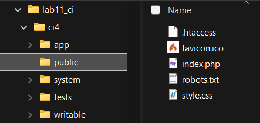

# Praktikum 1 Pemrograman Web 2

```bash
Aldi Hermansyah - 312310200 - Ti.23.A2
```

> Langkah-langkah praktikum 

---

## 1. Menghilangkan ; pada file xampp -> apache -> config -> php.ini

Hilangkan tanda `;` pada ekstensi yang akan diaktifkan. Kemudian simpan kembali filenya dan restart Apache web server.


---

## 2. Ketik http://localhost:8080/lab11_ci/ci4/public/ di browser

Akan muncul seperti gambar dibawah.

Jika error:

```bash
The framework needs the following extension(s) installed and loaded: intl.
```

Pada baris di langkah 1, belum dihilangkan `;`

```bash
before: ;extension=intl
after: extension=intl
```


---

## 3. Di PowerShell/CMD arahkan ke direktori project `C:/xampp/htdocs/lab11_ci/ci4`

Codeigniter 4 menyediakan CLI untuk mempermudah proses development.


---

## 4. Jalankan perintah `php spark`

Perintah yang dapat dijalankan untuk memanggil CLI Codeigniter.


---

## 5. Ubah nama file `env` menjadi `.env` dan mengubah nilai variabel `CI_ENVIRONTMENT` menjadi `development`


---

## 6. 


---

## 7. 


---

## 8. 


---

## 9. 


---

## 10. 


---

## 11. 


---

## 12. 


---

## 13. 


---

## 14. 


---

## 15. 


---

## 16. 


---

## 17. 


---

## 18. 


---

## 19. 



---

## 20. 


---

## 21. 


---

## 22. 


---
